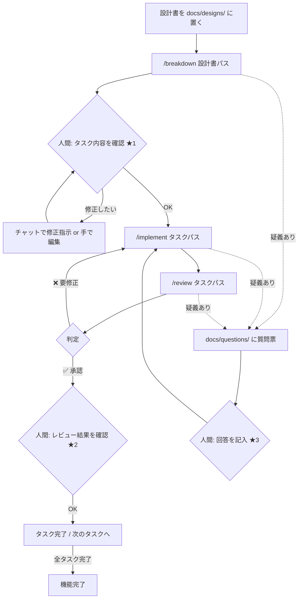

# 開発ワークフロー運用ガイド

このハーネスでの1機能（1設計書）の進め方です。対象読者は開発メンバー（AIの知識は前提にしません）。

## 全体の流れ

## 人間の3つのゲート

AIは便利ですが、この3か所だけは**必ず人間が判断**します。

| ゲート | タイミング | 確認すること |
| --- | --- | --- |
| ★1 タスク承認 | `/breakdown` の後 | タスク分割が妥当か。`_index.md` のカバレッジ表に漏れがないか。実装仕様の転記が設計書と合っているか |
| ★2 完了承認 | `/review` が承認を出した後 | レビューレポートに違和感がないか。重要機能なら差分も目視する |
| ★3 質問票回答 | 質問票が起きたとき | 設計書の曖昧さへの公式回答。**ここの回答品質が成果物の品質を決めます** |

## 具体的な操作（VS Code + Copilot Chat）

1. Copilot Chatを開く（エージェントモード）
2. チャット欄に `/breakdown docs/designs/DS-001_振込手数料計算` と入力して実行
3. 生成された `docs/tasks/DS-001/_index.md` を開いて確認（★1）
4. `/implement docs/tasks/DS-001/T-001_….md` を実行
5. 完了報告が出たら `/review docs/tasks/DS-001/T-001_….md` を実行
6. 承認なら確認（★2）して次のタスクへ。要修正なら表示された `/implement …` をそのまま実行
7. `docs/questions/` に未回答の質問票が出たら回答する（★3）

> プロンプト実行時にエージェントが自動で切り替わらない環境では、チャットのエージェント選択で `planner` / `implementer` / `reviewer` を選んでから実行してください。

## うまくいかないときは

| 症状 | 対処 |
| --- | --- |
| エージェントが設計書にないことを実装した | レビューで検出されるのが正常。すり抜けた場合は reviewer の手順（skill `spec-compliance-review`）に検出観点を追記する |
| タスクが大きすぎ/小さすぎる | skill `design-to-tasks` の「2. タスク境界を決める」の基準を案件に合わせて調整する |
| カバレッジ100%が通らない | skill `jacoco-coverage` の手順で不足分岐を特定。テスト不能なコードなら除外の承認手続きへ |
| 同じ指摘が何度も出る | その指摘を `.github/instructions/` の規約に昇格させる（規約に書けば最初から守られる） |
| エージェントの動きを変えたい | 役割の変更は `agents/`、手順の変更は `skills/`、規約の変更は `instructions/` を直す（[README](../README.md) の責務表を参照） |

## このハーネス自体の改善

運用して気づいた過不足は、遠慮なく `.github/` 配下のMarkdownを直してください。
「どのファイルを直すか」は各ディレクトリのREADMEに書いてあります。変更はコードレビューと同じくPRで共有することを推奨します。
