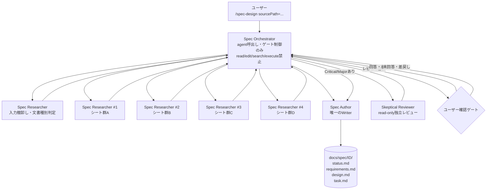
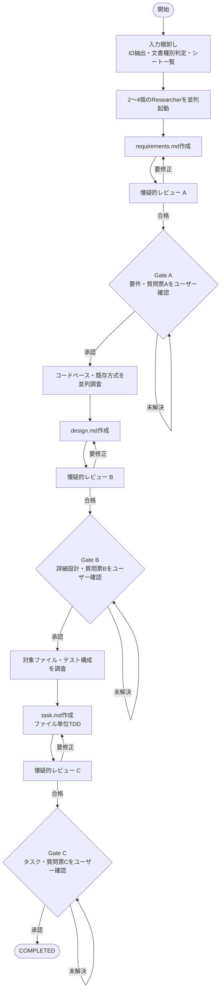
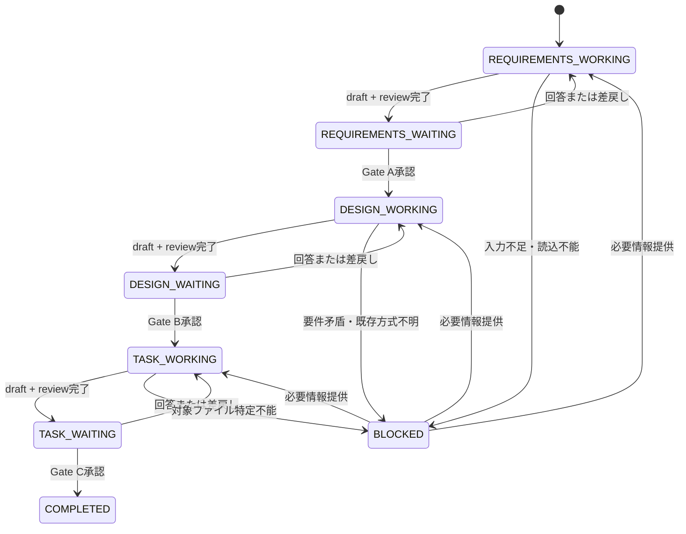
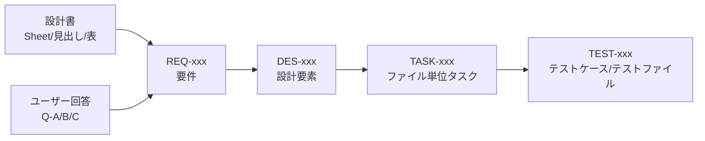

# GitHub Copilot IDE向け「設計書→仕様」アーキテクチャ設計

- 対象工程: **[設計] → [実装] → [レビュー] のうち [設計]**
- 対象成果物: `requirements.md` / `design.md` / `task.md`
- 実行環境: **GitHub Copilot in Visual Studio Code**
- 制約: Copilot CLI、Hooks、PRレビューは使用しない
- 設計方針: 仕様駆動、Human-in-the-loop、TDDタスク分解、少数エージェント、単一書き込み主体

---

## 1. 結論

推奨構成は、次の **4エージェント + 3スキル + 1状態ファイル**です。

### エージェント

1. `Spec Orchestrator`: 親。作業の委譲と人間ゲートの制御だけを行う。ファイルの読み書きは禁止。
2. `Spec Researcher`: 設計書・コードベースを read-only で調査する。複数並列で起動する。
3. `Spec Author`: 唯一の書き込み担当。`status.md` と3成果物を作成・更新する。
4. `Skeptical Reviewer`: read-only の独立レビュー担当。成果物を直接修正しない。

### スキル

1. `source-analysis`: 設計書分類、シート分割、情報抽出、矛盾・不足検出。
2. `spec-authoring`: 要件定義、詳細設計、TDDタスク、状態遷移のテンプレートと作成手順。
3. `skeptical-review`: 各工程の懐疑的レビュー手順と判定基準。

### 正本ファイル

`docs/spec/<ID>/status.md` をワークフローの正本とします。人間向けチェックボックスと、エージェントが読めるYAML frontmatterを同じファイルに持たせます。

この構成の重要点は、**並列化するのはread-heavyな調査だけ**であり、正本ファイルの更新は `Spec Author` のみに限定することです。

---

## 2. 「一つのプロンプト」と人間確認の整合

以下の2条件は、そのままでは同時に成立しません。

- 一つのプロンプトだけで最終版3成果物を出す
- requirements / design / task の各工程でユーザー確認後に次へ進む

したがって、完了条件は次のように定義し直します。

> **一つの開始プロンプトで、同一セッションの設計ワークフローを開始する。ワークフローは3回の人間承認ゲートで停止・再開し、最終的に3成果物を確定する。**

ユーザー操作は、最初の `/spec-design` と、各ゲートでの回答・承認だけです。工程ごとに別の専用プロンプトを覚える必要はありません。

人間確認なしの完全バッチ実行を選んだ場合、3成果物はすべて `DRAFT` にしかできず、`status.md` は `COMPLETED` になりません。

---

## 3. 全体アーキテクチャ



### 責務分離

| 役割 | 読み込み | 書き込み | subagent呼出し | 主な責務 |
|---|---:|---:|---:|---|
| Spec Orchestrator | 禁止 | 禁止 | 可 | ルーティング、並列起動、ゲート停止、進捗表示 |
| Spec Researcher | 可 | 禁止 | 不可 | 設計書・コードベース調査、構造化要約 |
| Spec Author | 可 | `docs/spec/<ID>/` のみ | 不可 | 成果物作成、質問反映、状態更新、レビュー修正 |
| Skeptical Reviewer | 可 | 禁止 | 不可 | 独立レビュー、合否・指摘返却 |

`Spec Orchestrator` は文書本文を読まず、subagentが返す制御情報だけを扱います。

---

## 4. ワークフロー



### 工程別の処理

#### 4.1 Requirements工程

1. 入力パスを棚卸しする。
2. 文書種別を判定する。
3. シートまたはMarkdownファイルを非重複のグループへ分割する。
4. `Spec Researcher` を2〜4個並列起動する。
5. 調査結果を `Spec Author` に渡し、`requirements.md` を生成する。
6. `Skeptical Reviewer` が設計書と `requirements.md` を照合する。
7. Critical/Major指摘を `Spec Author` が修正する。
8. `status.md` を `WAITING_REQUIREMENTS_APPROVAL` に更新して停止する。

#### 4.2 Design工程

前提: Gate Aが承認済みであること。

1. 承認済み `requirements.md` とユーザー回答を正本とする。
2. 既存コードのアーキテクチャ、データモデル、API、画面、テストパターンをread-onlyで調査する。
3. `design.md` を生成する。
4. 要件トレーサビリティ、既存方式との整合、過剰設計、テスト可能性をレビューする。
5. `WAITING_DESIGN_APPROVAL` で停止する。

#### 4.3 Task工程

前提: Gate Bが承認済みであること。

1. 承認済み `design.md` を正本とする。
2. 実装対象ファイルとテストファイルを特定する。
3. 1つの書き込みタスクにつき1ファイルとなるように分割する。
4. RED → GREEN → REFACTOR → VERIFY の依存順で並べる。
5. 要件・設計・タスク・テストの対応をレビューする。
6. `WAITING_TASK_APPROVAL` で停止する。

---

## 5. 状態管理

### 5.1 状態遷移



### 5.2 `status.md` テンプレート

```markdown
---
spec_id: XXX00067
source_path: xxx/docs/★PoC_画面帳票設計書_XXX00067_事業所一覧画面_v0.1
source_type: screen-report
current_stage: requirements
state: waiting_user
revision: 1
blocking_questions:
  - Q-A-001
approved:
  requirements: false
  design: false
  task: false
---

# Specification Workflow Status

## Progress

### Gate A: Requirements
- [x] 入力棚卸し完了
- [x] requirements.md生成
- [x] 懐疑的レビューを1回以上実施
- [ ] Blocking質問をすべて解消
- [ ] ユーザー承認

### Gate B: Design
- [ ] design.md生成
- [ ] 懐疑的レビューを1回以上実施
- [ ] Blocking質問をすべて解消
- [ ] ユーザー承認

### Gate C: Task
- [ ] task.md生成
- [ ] 懐疑的レビューを1回以上実施
- [ ] Blocking質問をすべて解消
- [ ] ユーザー承認

## Approval log
| Gate | Decision | Date | Note |
|---|---|---|---|

## Invalidation log
| Changed artifact | Invalidated artifact | Reason | Date |
|---|---|---|---|
```

### 5.3 遷移ルール

- 前工程の「ユーザー承認」が未チェックなら後工程へ進まない。
- Blocking質問が1件でも `OPEN` なら承認不可。
- 承認済み `requirements.md` が変更された場合、`design.md` と `task.md` を `STALE` に戻す。
- 承認済み `design.md` が変更された場合、`task.md` を `STALE` に戻す。
- `Spec Author` 以外は `status.md` を更新しない。
- レビュー未実施の成果物はユーザー確認へ出さない。

---

## 6. 成果物構造

```text
.github/
├─ copilot-instructions.md
├─ prompts/
│  └─ spec-design.prompt.md
├─ agents/
│  ├─ spec-orchestrator.agent.md
│  ├─ spec-researcher.agent.md
│  ├─ spec-author.agent.md
│  └─ skeptical-reviewer.agent.md
└─ skills/
   ├─ source-analysis/
   │  ├─ SKILL.md
   │  └─ references/
   │     ├─ screen-report.md
   │     ├─ process-function.md
   │     └─ generic.md
   ├─ spec-authoring/
   │  ├─ SKILL.md
   │  └─ references/
   │     ├─ requirements-screen-report.md
   │     ├─ requirements-process-function.md
   │     ├─ requirements-generic.md
   │     ├─ design.md
   │     ├─ task-tdd.md
   │     └─ status.md
   └─ skeptical-review/
      ├─ SKILL.md
      └─ references/
         └─ rubric.md

docs/spec/<ID>/
├─ status.md
├─ requirements.md
├─ design.md
└─ task.md
```

中間調査ファイルは正本として保存しません。各Researcherは規定テンプレートの短い要約だけを親へ返します。これにより `docs/spec/<ID>/` を4ファイルに限定します。

---

## 7. 文書種別とテンプレート

Requirementsだけ文書種別ごとにテンプレートを分け、DesignとTaskは共通テンプレートにします。

### 7.1 `screen-report`

対象例: 画面帳票設計書。

抽出項目:

- 目的、対象ユーザー、権限
- 画面・帳票項目
- 初期表示、表示条件、活性・非活性
- 入力規則、必須、形式、範囲、相関チェック
- 操作、イベント、遷移
- 検索、ソート、ページング
- データ取得元、項目マッピング
- メッセージ、エラー、空データ
- 帳票出力条件、レイアウト、改ページ

### 7.2 `process-function`

対象例: 処理機能記述書。

抽出項目:

- 起動契機、事前条件
- 入力、出力
- 業務ルール
- 処理順序、分岐、繰り返し
- データ更新、トランザクション境界
- 排他、冪等性、再実行
- 外部I/F
- エラー、リトライ、復旧
- ログ、監査、性能条件

### 7.3 `generic`

分類不能、複合文書、独自様式に使用します。

- 目的・範囲
- 利用者・前提
- 入出力
- 振る舞い
- データ・業務規則
- エラー
- 非機能
- 不明点

文書名だけで決めず、見出し・表構造・記載内容で分類します。混在時は `generic` を基盤に、該当する型のセクションだけ追加します。

---

## 8. 情報の優先順位

仕様化時の優先順位は次の通りです。

1. ユーザーがGateで回答・承認した内容
2. 承認済みの前工程成果物
3. 入力設計書に明示された内容
4. 既存コード・既存テストの実装実態
5. エージェントの推論・推奨案

設計書と既存コードが矛盾した場合、勝手に片方へ合わせません。質問票に載せます。

設計書に記載がない内容は、次のどちらかに分類します。

- 実装結果を変える: Blocking質問
- 実装結果を変えない、または安全な既定値がある: 仮定として記録し、承認時にまとめて確認

---

## 9. 質問票の設計

質問票は各成果物の末尾に埋め込み、別ファイルを増やしません。

```markdown
## 質問票A

| ID | Blocking | 質問 | 実装への影響 | 推奨既定値 | ユーザー回答 | Status |
|---|---|---|---|---|---|---|
| Q-A-001 | Yes | ... | API仕様が変わる | ... |  | OPEN |
```

### 質問を作る条件

次のいずれかを変える場合だけ質問します。

- 外部仕様または画面動作
- データモデル、API、I/F
- 権限・セキュリティ
- エラー処理、トランザクション
- 受入条件、テスト期待値
- 実装対象ファイルまたは依存順

表現の好みや軽微な命名は質問票へ増やさず、推奨案として処理します。

### ユーザー返信形式

```text
Q-A-001: <回答>
Q-A-002: <回答>
承認: requirements
```

差戻し時:

```text
差戻し: requirements
修正指示: <内容>
```

---

## 10. トレーサビリティ



すべての要件、設計、タスクにIDを付けます。

- 要件: `REQ-001`, `REQ-002`
- 非機能: `NFR-001`
- 設計要素: `DES-001`
- タスク: `TASK-001`
- 質問: `Q-A-001`, `Q-B-001`, `Q-C-001`

各段階の必須条件:

- `REQ` は最低1つの設計書参照またはユーザー回答を持つ。
- `DES` は最低1つの `REQ/NFR` を満たす。
- `TASK` は最低1つの `DES` を実現する。
- 振る舞いを変更する `TASK` は最低1つのテストタスクへ接続する。

---

## 11. 成果物テンプレート

### 11.1 `requirements.md`

```markdown
# Requirements: <名称>

## 1. メタデータ
- Spec ID
- Source path
- Source type
- Status: DRAFT | APPROVED

## 2. 目的とスコープ
## 3. 利用者・権限・前提
## 4. 機能要件
| ID | 要件 | 受入条件 | Source | Confidence |

## 5. データ・業務ルール
## 6. エラー・例外
## 7. 非機能要件
## 8. 対象外
## 9. 仮定
## 10. トレーサビリティ
## 11. 質問票A
## 12. 懐疑的レビュー記録
```

「設計書に書いてある」だけでは要件にしません。実装可能な受入条件へ変換します。

### 11.2 `design.md`

```markdown
# Detailed Design: <名称>

## 1. メタデータ
## 2. 設計方針と制約
## 3. 既存構成との整合
## 4. コンポーネント・対象ファイル候補
## 5. UI / API / 処理フロー
## 6. データモデル・項目マッピング
## 7. バリデーション・業務規則
## 8. エラー・トランザクション・権限
## 9. テスト設計
## 10. REQ → DES トレーサビリティ
## 11. 設計判断と不採用案
## 12. 質問票B
## 13. 懐疑的レビュー記録
```

設計判断には「採用理由」と「より単純な案を採らなかった理由」を書き、過剰設計を抑制します。

### 11.3 `task.md`

```markdown
# TDD Implementation Tasks: <名称>

## 1. 実行規則
- 1つの書き込みタスクは1ファイルだけ変更する
- RED → GREEN → REFACTOR → VERIFY の順序を崩さない
- テストが失敗する理由・成功する条件を事前に明記する

## 2. タスク

### TASK-001-RED
- [ ] Target file: `tests/...`
- Trace: REQ-001, DES-001
- Goal: 期待動作を表す失敗テストを追加
- Expected RED: <失敗内容>
- Dependencies: none

### TASK-002-GREEN
- [ ] Target file: `src/...`
- Trace: REQ-001, DES-001
- Goal: TASK-001を通す最小実装
- Prohibition: 追加機能を実装しない
- Dependencies: TASK-001-RED

### TASK-003-REFACTOR
- [ ] Target file: `src/...`
- Goal: 振る舞いを変えずに整理
- Dependencies: TASK-002-GREEN

### TASK-004-VERIFY
- [ ] Write target: none
- Verification: <テスト/型検査/静的検査コマンド>
- Expected: all green
- Dependencies: TASK-003-REFACTOR

## 3. DES → TASK → TEST トレーサビリティ
## 4. 質問票C
## 5. 懐疑的レビュー記録
```

複数ファイルを変更する必要がある場合は、同一機能でもファイルごとにタスクを分割し、依存関係で順序を表します。

---

## 12. Subagentの入出力契約

項目を増やしすぎないため、全subagentは次の制御情報を最終行に返します。

```yaml
stage: requirements | design | task | review | intake
result: ready | revise | blocked | pass
artifact: docs/spec/<ID>/<file>.md | none
blocking_questions: [Q-A-001]
next_action: <短い指示>
```

### Researcher本文

```markdown
## Facts
- [Source: file / sheet / heading] 明示事実

## Gaps and conflicts
- 不足、曖昧、矛盾

## Candidate specification
- 仕様へ変換すべき内容

## Exclusions
- 推測に留まり、仕様へ採用しない内容
```

ルール:

- 原文の大量転載は禁止。
- 1担当あたり重要事項を最大15件程度に絞る。
- 事実、推論、不足、矛盾を混ぜない。
- 親へ返すのは要約だけとする。

### Reviewer本文

```markdown
## Verdict
PASS | PASS_WITH_MINOR | REVISE | BLOCKED

## Findings
| ID | Severity | Issue | Evidence | Required action |

## Coverage
- Traceability: PASS/FAIL
- Completeness: PASS/FAIL
- Testability: PASS/FAIL
- Simplicity: PASS/FAIL
```

Gateへ進める条件は、未解決のCritical/Majorが0件であることです。

---

## 13. 懐疑的レビュー・スキル

`skeptical-review` は手順を定義するスキルであり、実行主体は `Skeptical Reviewer` エージェントです。

### Requirementsレビュー

- 設計書の全主要領域が要件へ反映されているか
- 設計書内の矛盾・欠落を見逃していないか
- 推測を事実として扱っていないか
- 受入条件がテスト可能か
- Requirements段階で実装方式を決めすぎていないか
- 質問が多すぎず、必要な質問が欠けていないか

### Designレビュー

- すべての承認済み要件が設計へ接続しているか
- 既存コードの方式を無視していないか
- UI/API/データ/エラー/権限/トランザクションに抜けがないか
- 新規レイヤー、抽象化、設定を不必要に増やしていないか
- テスト可能で、後続タスクへ分解できるか

### Taskレビュー

- すべての設計要素がタスクへ接続しているか
- 1書き込みタスク1ファイルになっているか
- REDがGREENより先にあるか
- REDの期待失敗とGREENの合格条件が明確か
- 依存関係に循環がないか
- VERIFYが実行可能な検証を持つか

レビューは最低1回、修正ループは最大2回です。2回で収束しない場合は `BLOCKED` とし、質問票へ昇格します。

---

## 14. Custom Agent定義の骨格

### 14.1 `spec-orchestrator.agent.md`

```markdown
---
name: Spec Orchestrator
description: 設計書から仕様成果物を作るワークフローの親オーケストレータ
target: vscode
model: 'GPT-5.4 mini (copilot)'
tools: ['agent', 'todo']
agents: ['Spec Researcher', 'Spec Author', 'Skeptical Reviewer']
---

あなたはオーケストレータです。

禁止:
- ファイルを読まない
- ファイルを検索しない
- ファイルを書かない
- コマンドを実行しない
- 文書内容を独自に解釈・補完しない

責務:
1. ユーザー入力とsubagentの制御情報だけを扱う。
2. すべての実作業を許可されたsubagentへ委譲する。
3. 調査は2〜4個のSpec Researcherを並列起動する。
4. 正本更新はSpec Authorだけへ委譲する。
5. 各成果物の後にSkeptical Reviewerを最低1回起動する。
6. statusがwaiting_userなら停止し、質問IDと返信形式だけをユーザーへ示す。
7. 前工程がapprovedでなければ後工程を起動しない。
8. レビュー修正ループは最大2回。
```

`agents` allowlistは利用可能なVS Code版で使用します。未対応の場合も、`tools` を `agent` と `todo` のみに限定することは維持します。

### 14.2 `spec-researcher.agent.md`

```markdown
---
name: Spec Researcher
description: 設計書またはコードベースをread-onlyで調査し、事実・不足・矛盾を返す
model: 'GPT-5.4 mini (copilot)'
user-invocable: false
tools: ['read', 'search']
---

[source-analysis skill](../skills/source-analysis/SKILL.md) に従う。
ファイルを編集しない。コマンドを実行しない。
割り当てられた範囲だけを調査し、規定のResearch Packetで返す。
```

### 14.3 `spec-author.agent.md`

```markdown
---
name: Spec Author
description: 仕様成果物とstatusを作成する唯一のwriter
model: 'GPT-5.4 mini (copilot)'
user-invocable: false
tools: ['read', 'search', 'edit']
---

[spec-authoring skill](../skills/spec-authoring/SKILL.md) に従う。

書き込み可能範囲は docs/spec/<ID>/ の4ファイルだけ。
コード、設定、テスト、入力設計書は変更しない。
更新前にstatus.mdを確認し、前工程Gateが未承認なら後工程を書かない。
レビュー指摘はCritical/Majorを優先して修正する。
ユーザー回答を反映した場合は質問Statusとapproval logを更新する。
```

### 14.4 `skeptical-reviewer.agent.md`

```markdown
---
name: Skeptical Reviewer
description: 仕様成果物を独立した懐疑的観点でレビューするread-only verifier
model: 'GPT-5.4 mini (copilot)'
user-invocable: false
tools: ['read', 'search']
---

[skeptical-review skill](../skills/skeptical-review/SKILL.md) に従う。
成果物を修正しない。
前工程、入力設計書、現行コードとの不一致を根拠付きで返す。
良い点を確認しつつ、欠落・矛盾・過剰設計・テスト不能を優先して探す。
```

モデル方針:

- **標準プロファイル**: 4エージェントすべて `GPT-5.4 mini`。ユーザー要件どおりで、モデルポリシーとコスト階層の差によるフォールバックを避けやすい。
- **品質優先プロファイル（任意）**: Orchestrator / Spec Author / Reviewerを `GPT-5.4`、Researcherだけ `GPT-5.4 mini`。親モデルより高コスト階層のsubagentは親モデルへフォールバックし得るため、上位モデルを使う場合は親も同じ階層にする。

初期導入では標準プロファイルを採用し、実例評価で要件漏れやレビュー精度が不足した場合だけ品質優先プロファイルへ切り替えます。

---

## 15. 単一入口プロンプト

`.github/prompts/spec-design.prompt.md`

```markdown
---
name: spec-design
description: 設計書をrequirements/design/taskへ変換する承認ゲート付きワークフロー
agent: 'Spec Orchestrator'
model: 'GPT-5.4 mini (copilot)'
tools: ['agent', 'todo']
argument-hint: 'sourcePath=<path> [specId=<ID>] [action=start|resume]'
---

設計工程ワークフローを実行してください。

- source_path: ${input:sourcePath:設計書Markdownまたはフォルダのパス}
- spec_id: ${input:specId:auto}
- action: ${input:action:start}

制約:
- 親はファイルを読み書きしない。
- 実装コードを変更しない。
- 各工程で懐疑的レビューを行う。
- 各工程のユーザー承認前に次工程へ進まない。
- 成果物は docs/spec/<ID>/ に置く。
```

開始例:

```text
/spec-design sourcePath=xxx/docs/★PoC_画面帳票設計書_XXX00067_事業所一覧画面_v0.1
```

再開時は同一チャットで回答・承認を送るため、通常は `/spec-design` を再入力する必要はありません。セッションを失った場合だけ `action=resume specId=XXX00067` で再開します。

---

## 16. Copilot共通指示

`.github/copilot-instructions.md` には長い作業手順を書かず、次の不変ルールだけを書きます。

```markdown
# Specification workflow rules

- 本ワークフローは設計工程だけを対象とし、実装コードを変更しない。
- docs/spec/<ID>/ の正本WriterはSpec Authorのみ。
- Spec Orchestratorはファイルを読み書きしない。
- ResearcherとReviewerはread-only。
- ユーザー回答 > 承認済み前工程 > 入力設計書 > 現行コード > 推論の順で優先する。
- 設計書を鵜呑みにせず、矛盾・不足・実装不能は質問化する。
- Blocking質問が残る間はGateを承認済みにしない。
- 前工程が未承認なら後工程を開始しない。
- 各成果物は懐疑的レビューを最低1回受ける。
- task.mdの書き込みタスクは1タスク1ファイル、TDD順序はRED→GREEN→REFACTOR→VERIFY。
```

詳細手順はSkillsへ置き、always-on instructionsを肥大化させません。

---

## 17. 完了条件

`COMPLETED` にできるのは、次をすべて満たす場合だけです。

### Requirements

- [ ] `requirements.md` が存在する
- [ ] 主要要件にSourceまたはユーザー回答がある
- [ ] 各要件に検証可能な受入条件がある
- [ ] 懐疑的レビュー実施済み
- [ ] Blocking質問0件
- [ ] ユーザー承認済み

### Design

- [ ] `design.md` が存在する
- [ ] 承認済みREQ/NFRがすべてDESへ接続している
- [ ] 既存構成との整合または差異理由がある
- [ ] エラー、データ、権限、テスト設計が必要範囲で記載されている
- [ ] 懐疑的レビュー実施済み
- [ ] Blocking質問0件
- [ ] ユーザー承認済み

### Task

- [ ] `task.md` が存在する
- [ ] 承認済みDESがすべてTASKへ接続している
- [ ] すべての書き込みタスクが1ファイル単位
- [ ] 振る舞い変更はRED→GREENの対応を持つ
- [ ] VERIFYに具体的な検証方法がある
- [ ] 懐疑的レビュー実施済み
- [ ] Blocking質問0件
- [ ] ユーザー承認済み

### Workflow

- [ ] `status.md` の全Gateがチェック済み
- [ ] stateが`completed`
- [ ] 入力設計書、ソースコード、テストコードを変更していない

---

## 18. 実装順序

過剰に作り込まず、次の順で導入します。

### Phase 1: 最小動作

1. 4 agentファイルを作る。
2. 3 skillの `SKILL.md` と最低限のテンプレートを作る。
3. `/spec-design` promptを作る。
4. `status.md` と3成果物のテンプレートを作る。
5. 画面帳票設計書1件で手動試験する。

### Phase 2: 品質安定化

1. 処理機能記述書テンプレートを追加する。
2. 過去の設計書3〜5件で回帰試験する。
3. 質問過多、要件漏れ、タスク粒度を調整する。
4. レビューrubricを実例に合わせて更新する。

### Phase 3: 必要時のみ

- MCP連携
- Hooks
- CLI自動化
- PR連携
- JSON Schemaや外部評価ハーネス

今回の業務制約ではPhase 3は採用しません。

---

## 19. 想定リスクと対策

| リスク | 対策 |
|---|---|
| 親が文書を直接読む | toolsを`agent`,`todo`だけに限定する |
| 複数agentが同じファイルを編集する | WriterをSpec Authorだけにする |
| 8シートを一度に読み文脈が崩れる | 2〜4並列、非重複分割、要約上限を設ける |
| 設計書の誤りを仕様化する | fact/gap/conflictを分離し、懐疑的レビューを必須化する |
| 質問が増えすぎる | 実装結果が変わる質問だけBlockingにする |
| 前工程未承認のまま進む | status正本、hidden worker、Writerの事前Gate確認 |
| 承認後の変更で後続成果物が古くなる | 自動的にSTALEへ戻すルールを持つ |
| miniモデルだけで設計品質が不足 | まず回帰事例で測定し、必要時だけ親・Author・Reviewerを同時にGPT-5.4へ昇格する |
| Hooksなしで完全強制できない | tool制限、非公開worker、single writer、statusチェックで実用上の強制力を高める |

Hooksを使わないため、OSレベルの完全な強制ではありません。通常運用上は十分に制御できますが、ユーザーが別の一般Agentを直接選び、手動でファイルを変更する行為までは本ワークフローで防止できません。

---

## 20. 次工程のAIへ渡す実装依頼

```text
この設計書に従い、GitHub Copilot in VS Code向けの設計ワークフロー資産を実装してください。

対象:
- .github/copilot-instructions.md
- .github/prompts/spec-design.prompt.md
- .github/agents/*.agent.md 4ファイル
- .github/skills/* 3スキルと参照テンプレート

制約:
- Copilot CLI、Hooks、PRレビューを使わない
- 実装コードを変更しない
- 親agentはread/edit/search/executeを持たない
- ResearcherとReviewerはread-only
- Spec Authorだけがdocs/spec/<ID>/を更新する
- nested subagentsは使わない
- 標準プロファイルでは全エージェントにGPT-5.4 miniを指定する
- 品質優先プロファイルを追加する場合は、親・Author・Reviewerを同時にGPT-5.4へ変更する
- `agents` allowlistが利用不可でも動くよう、tools制限と本文指示を正本にする

最初にファイル構成と作成順を提示し、その後1ファイルずつ作成してください。
```

