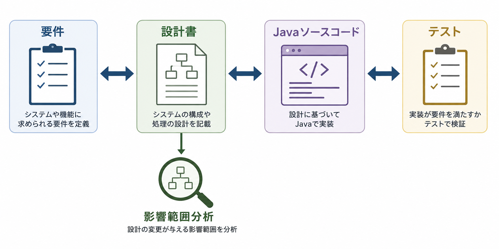
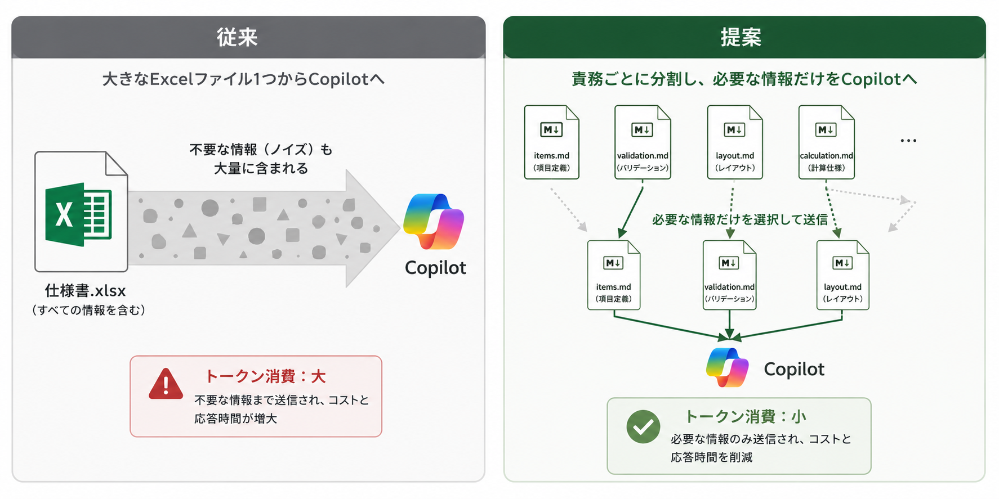
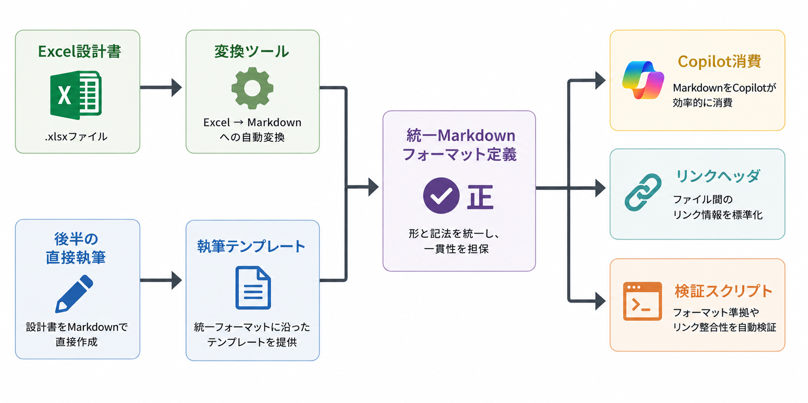

<!-- _class: lead -->

# 設計書のMarkdown化と
# Requirements Traceability の導入

## Copilot 中心の開発に最適化した設計書体系の提案

---

# 背景：いまの状況

- COBOL → Java 移行プロジェクト（**約420機能**）
- 設計書は全機能統一フォーマットの **Excel**（画面設計7シート＋機能設計5シート＋DB設計）
- 実装は **GitHub Copilot を中心**に進める方針
- 設計書を **Markdown 化**する方針（フォーマット変更の許可あり）

**このタイミングで「どんな Markdown にするか」を決める**

---

# 課題：無駄トークン問題

- 現在の Excel → Markdown 自動変換は、不要な行までコピーしている
- 大きな設計書を丸ごと読み込むと、**タスクに関係ない部分までトークンを消費**
- Copilot のクレジットは有限（利用制限あり）── 無駄読みはコスト・精度の両方に効く

> 例えるなら：「1つの値を使うために、巨大なオブジェクトを毎回丸ごと受け渡す」状態

**解決の方向性 = 「必要なものだけを、確実に辿れる」設計書体系**

---

# 提案手法：Requirements Traceability（要求トレーサビリティ）

要件・設計・実装・テストといった成果物同士を**リンクで結び**、
「変更の影響範囲」や「実装の根拠」を双方向に追跡できるようにする手法

- 国際規格 **ISO/IEC/IEEE 29148**（要求工学）で定義される標準的な考え方
- 車載・医療・金融など、高信頼性が求められる分野で広く採用
---
## 参考
---
## [なぜ Copilot 中心だと効くのか：コンテキスト経済]のイメージ図

<!-- 画像生成プロンプト: 「要件 → 設計書 → Javaソースコード → テスト」の4つの成果物が左から右に並び、双方向の矢印リンクで結ばれている概念図。中央の設計書から下向きに「影響範囲分析」の虫眼鏡アイコン。シンプルなフラットデザイン、ビジネス資料向け、日本語ラベル付き。 -->
---

# 業界での実績：枯れた手法 × 新しい潮流

**確立された実績（トレーサビリティ）**

- **OpenFastTrace**：Java 向け OSS。組込・車載など高信頼分野で利用。リンクの双方向検証をビルドで自動化
- **doorstop / Sphinx-Needs**：テキストベースの要求管理 OSS。Git と一体で運用

**2024年以降の潮流（AI コーディング標準）**

- **GitHub Spec Kit** など「Spec-Driven Development」：仕様書を Markdown でリポジトリに置き、AI がそれを読んで実装する開発様式
- **AGENTS.md / CLAUDE.md** 慣行：「AI エージェントが自力で辿れるリポジトリ」を作ることが業界標準になりつつある

**本提案は、この2つの流れの交点にあります**

---

# 先人の失敗から学ぶ：手動管理のトレーサビリティは死ぬ

- 手動で管理するトレーサビリティ表（Excel の対応表など）は、
  **更新が追いつかず約6ヶ月で20〜40%のリンクが実態と乖離**するという調査報告
- 失敗の原因は共通：「人間の記憶と善意」に依存した運用

**対策（本提案に組み込み済み）**

| 失敗パターン | 本提案での対策 |
|---|---|
| 対応表の手動維持が破綻 | 対応表は**スクリプトで自動生成**（手で書かない） |
| リンク切れの放置 | **検証スクリプト**でリンク実在を機械チェック |
| リンク記入の手間で形骸化 | Copilot の**コード生成時に自動挿入**（手間ゼロ） |

---

# なぜ Copilot 中心だと効くのか：コンテキスト経済

Copilot への入力（コンテキスト）は「多いほど良い」ではなく、
**「タスクに必要なものだけ」が最も精度が高く、最も安い**

- 設計書を**責務単位**（項目定義・バリデーション・レイアウト…）に分割
- 1つの生成タスクが読むのは **2〜4ファイル**に収まる設計
- Java の「インターフェース分離原則」の設計書版：
  *「Form を生成するタスクに、レイアウト仕様を読ませない」*

---
## [なぜ Copilot 中心だと効くのか：コンテキスト経済]のイメージ図

<!-- 画像生成プロンプト: 左右比較図。左側：「従来」として大きなExcelファイル1つから太い矢印がCopilotに伸び、矢印の中に不要な情報を示すグレーのノイズが混ざっている（トークン消費大の注釈）。右側：「提案」として責務ごとに分割された小さなMarkdownファイル群（items.md, validation.md, layout.mdなど）から必要な2〜3ファイルだけが細い矢印でCopilotに届く（トークン消費小の注釈）。フラットデザイン、日本語ラベル。 -->

---

# 完成形①：設計書ディレクトリの構造

機能ID（既存の管理番号）をキーに、**責務単位のファイル**で構成

```
spec/
├── front/FUNC-0123/
│   ├── layout.md       ← 画面レイアウト
│   ├── items.md        ← 項目定義
│   └── validation.md   ← バリデーション
├── back/FUNC-0123/
│   ├── methods.md      ← 画面で使うメソッド
│   └── logic.md        ← 業務ロジック
├── db/
│   └── T_ORDER.md      ← テーブル単位
├── rules/
│   └── BR-0045.md      ← 業務ルール（ID台帳）
└── common/             ← 全画面共通部（複製しない）
```

- ファイル名は機能IDで固定・**リネーム禁止**（リンク切れの主因を排除）

---

# 完成形②：ソースコードからのリンクと消費マトリクス

Java ファイルの先頭に、参照する設計書へのリンクを **Javadoc タグ**で記載

```java
/**
 * @spec-front spec/front/FUNC-0123/items.md
 * @spec-back  spec/back/FUNC-0123/methods.md
 * @spec-db    spec/db/T_ORDER.md
 * @biz-rule   BR-0045
 */
@Controller
public class OrderListController { ... }
```

「どのファイルが何を読むか」は**全417機能で共通のルール**

| 生成するファイル | 読む設計書 |
|---|---|
| Form | items.md + validation.md |
| Thymeleaf | layout.md + items.md |
| Controller | methods.md + validation.md |
| Service | methods.md + logic.md + 該当テーブル |

→ リンクは人が考えるものではなく、**生成時に機械的に挿入される**

---

# 運用：検証スクリプトが品質を守る

Python スクリプト1本で、以下を自動実行

1. **リンク実在チェック**：参照先の設計書ファイルが存在するか
2. **網羅チェック**：全 Controller / Service にリンクヘッダがあるか
3. **フォーマット lint**：設計書に必須セクションが揃っているか
4. **逆引きマップの自動生成**：「この設計書はどこに実装されているか」の対応表

**導入は3段階で進化（CI が使えない現状でも開始可能）**

| 段階 | 実行方法 |
|---|---|
| 今すぐ | 作業完了条件に「スクリプト緑」を組み込み（手動実行） |
| 慣れたら | pre-commit で自動実行 |
| CI 解禁後 | CI に載せ替え（スクリプトは無変更） |

---

# 移行計画：Excel 変換と直接執筆の「二本立て」

設計作業は進行中のため、**前半は Excel 変換・後半は Markdown 直接執筆**が併存

- 主役は変換ツールではなく **「Markdown フォーマット定義」**（テンプレート＋記入例）
- Excel 変換ツールも、直接執筆も、**同じフォーマット定義に合流**させる
- Copilot から見て「変換された機能」と「直書きされた機能」の区別がつかない状態がゴール
---
## [移行計画：Excel 変換と直接執筆の「二本立て」]のイメージ図

<!-- 画像生成プロンプト: 合流図。左上から「Excel設計書」→「変換ツール」の経路、左下から「後半の直接執筆」→「執筆テンプレート」の経路が、中央の「統一Markdownフォーマット定義（正）」に合流し、そこから右へ「Copilot消費」「リンクヘッダ」「検証スクリプト」に枝分かれする流れ図。フラットデザイン、日本語ラベル、矢印は左から右へ。 -->

---

# 先行条件：代表機能での対応マップ検証

現在の「設計シート → Java ファイル」対応マップは**確信度：低（未検証）**

分割フォーマットはこのマップが土台のため、**順序が重要**

1. 代表機能 1〜2 個で実物調査（vertical dig）→ 対応マップを「高」に引き上げ
2. Markdown フォーマット定義を確定（テンプレート＋消費マトリクス＋ヘッダ規約）
3. 検証スクリプト v1 を作成
4. 変換ツール・直接執筆テンプレートを定義に合わせて整備

> マップが誤ったまま 417 機能分を変換すると、全量やり直しのリスク

---

# 期待効果

| 効果 | 内容 |
|---|---|
| **影響範囲分析が一瞬** | 設計変更 → 機能IDで検索 → 修正対象ファイル一覧が即座に判明 |
| **リンク維持コストほぼゼロ** | Copilot のコード生成時に自動挿入。手作業なし |
| **トークン消費の削減** | 責務単位の分割で、タスクに必要な設計書だけを読む |
| **実装根拠が常に明示** | 全ソースの先頭に「どの設計書に基づくか」が記載 |
| **引き継ぎに強い** | grep とスクリプトだけで動く。特殊ツール不要 |

**受け入れテストも機械的：**
「Copilot に『FUNC-0123 に関連する設計書・テーブル・業務ルールを全部挙げて』と質問し、正答すれば合格」

---

# リスクと対策

| リスク | 対策 |
|---|---|
| **分割しすぎ**（ファイルが細かすぎて逆に読みにくい） | 「1タスクが読むのは2〜4ファイル」を基準に統合。分割理由は「消費者が違う」場合のみ |
| **フォーマットの方言化**（Excel変換分と直書き分で構造がズレる） | フォーマット定義を唯一の「正」とし、検証スクリプトの lint で機械的に検出 |
| **対応マップの誤り**（誤った土台で全量変換） | 代表機能の実物検証を先行（前スライドの順序を厳守） |
| **バッチへの過剰適用** | バッチ37本は画面とは別の消費マトリクスを定義（原則は同じ、具体形は別） |

---

<!-- _class: lead -->

# まとめ

**Requirements Traceability × 責務分割 Markdown は、**
**「Copilot に必要なものだけを、確実に辿らせる」ための設計書体系**

- 国際規格に基づく標準手法 × AI コーディング時代の新標準の交点
- 手動管理の失敗パターンを「生成する・検証する」で回避
- 今すぐ着手可能：代表機能の実物検証（vertical dig）から

**次のアクション：代表機能1〜2個の選定と実物調査の開始**
