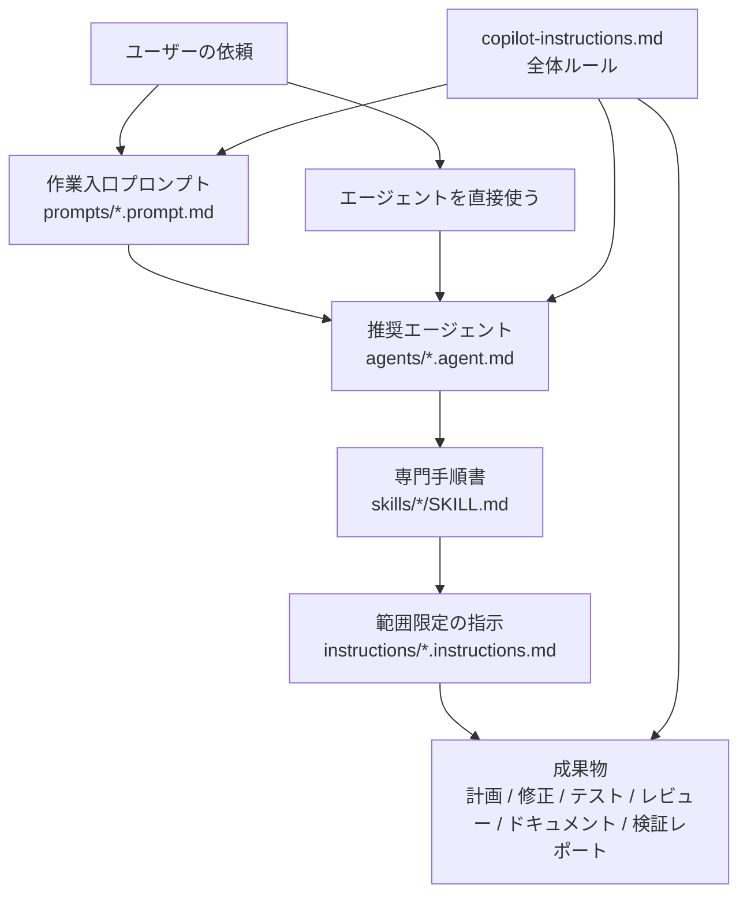

# .github 資産マップ

## 目的

このファイルは、`.github` 配下のプロンプト、エージェント、スキル、指示を単なるファイル一覧ではなく、実際の作業でどう組み合わせて使うかを示す成果物一覧兼関係マップです。

この配布パック内の入れ子 `.github` は、対象リポジトリのルートにコピーされるまで GitHub Copilot / VS Code のリポジトリ指示、プロンプト、エージェント、スキルとしては有効になりません。ここでは、コピー後にどの資産がどの順で参照されるかを整理します。

## ディレクトリ構成

| ディレクトリ / ファイル | 件数 | 役割 |
| --- | ---: | --- |
| `copilot-instructions.md` | 1 | リポジトリ全体に効く常時ルール。調査先行、既存規約優先、TDD、検証、秘密情報保護、完了報告の分離を全体に効かせる。 |
| `instructions/` | 6 | `applyTo` で対象パスにだけ効く範囲限定の指示。Java/Spring、データベース、セキュリティ、テスト、ドキュメント、エージェント運用を薄く制御する。 |
| `prompts/` | 13 | 手動起動する作業入口テンプレート。TDD、E2E、レビュー、計画、検証など、作業開始時の型を提供する。 |
| `agents/` | 9 | 専門担当の役割定義。プロンプトから推奨されるか、ユーザーが直接エージェントを選んで実行する。 |
| `skills/` | 19 | 専門手順書。エージェントやプロンプトの中で読み、TDD、E2E、セキュリティ、データベース、デプロイ、エージェント活用などの手順とチェック観点を補う。 |

## 運用の流れ



## プロンプト別の入口

| プロンプト | 推奨エージェント / 実行先 | 必ず参照するスキル | 関連する指示 | 画像・証跡 |
| --- | --- | --- | --- | --- |
| `checkpoint.prompt.md` | 専用エージェントなし。エージェントモードで git 状態と記録方式を確認して実行。 | `verification-loop`, `agentic-engineering` | `agent-harness`, `documentation` | いいえ |
| `code-review.prompt.md` | `code-reviewer`。Java/DB/セキュリティ差分は専門レビュアーへ分担し、`springboot-security`, `jpa-patterns`, `postgres-patterns` は必要時に専門側で参照。 | `verification-loop`, `ai-regression-testing`, `security-review`, `java-coding-standards`, `springboot-verification` | `security`, `java-spring`, `database`, `testing` | いいえ |
| `e2e.prompt.md` | `e2e-runner`。重要ユーザーフローの設計、作成、実行、失敗解析。 | `e2e-testing`, `ai-regression-testing`, `verification-loop` | `testing`, `security` | 必要に応じてスクリーンショットやトレース |
| `learn-eval.prompt.md` | 専用エージェントなし。エージェントモードで抽出候補を評価し、保存前確認で止める。 | `agentic-engineering`, `agent-harness-construction`, `verification-loop` | `documentation`, `agent-harness` | いいえ |
| `learn.prompt.md` | 専用エージェントなし。エージェントモードで再利用パターンの下書きまで作る。 | `agentic-engineering`, `agent-harness-construction` | `documentation`, `agent-harness` | いいえ |
| `orchestrate.prompt.md` | `planner` を進行役にし、フェーズごとに `tdd-guide`, `code-reviewer`, `security-reviewer`, `database-reviewer`, `e2e-runner`, `doc-updater` へ委譲。 | `agentic-engineering`, `ai-first-engineering`, `verification-loop`, 各フェーズに応じたスキル | `agent-harness`, `testing`, `security`, `java-spring`, `database`, `documentation` | 必要に応じて |
| `plan.prompt.md` | `planner`。設計判断が重い場合は任意で `architect` を併用。 | `agentic-engineering`, `ai-first-engineering`, `api-design`, `database-migrations`, `deployment-patterns` | `agent-harness`, `java-spring`, `database`, `security`, `documentation` | いいえ |
| `quality-gate.prompt.md` | 専用エージェントなし。エージェントモードで品質ゲートを実行。PR 前レビューでは任意で `code-reviewer`。 | `verification-loop`, `springboot-verification`, `security-review` | `testing`, `security`, `java-spring`, `database` | いいえ |
| `skill-create.prompt.md` | 専用エージェントなし。エージェントモードで Git 履歴と既存規約を証拠優先で分析。 | `agent-harness-construction`, `agentic-engineering` | `agent-harness`, `documentation` | いいえ |
| `tdd.prompt.md` | `tdd-guide`。Spring Boot ではレイヤー別テストと回帰テストを併用。 | `tdd-workflow`, `springboot-tdd`, `ai-regression-testing`, `verification-loop`, `springboot-verification` | `testing`, `java-spring`, `database`, `security` | いいえ |
| `test-coverage.prompt.md` | `tdd-guide`。不足ケースの追加とカバレッジ前後比較を実行。 | `tdd-workflow`, `springboot-tdd`, `ai-regression-testing`, `verification-loop` | `testing`, `java-spring`, `database`, `security` | いいえ |
| `update-docs.prompt.md` | `doc-updater`。実コード、設定、スクリプトを根拠に README/docs を同期。 | `agent-harness-construction`, `deployment-patterns`, `api-design` | `documentation`, `agent-harness` | 必要に応じて図表 |
| `verify.prompt.md` | 専用エージェントなし。エージェントモードで `quick` / `full` / `pre-commit` / `pre-pr` の各モードを実行。PR 前では任意で `code-reviewer`。 | `verification-loop`, `springboot-verification`, `security-review` | `testing`, `security`, `java-spring`, `database` | いいえ |

## エージェント別の役割

| エージェント | 呼び出し元プロンプト | 参照するスキル | 従う指示 | 出力 |
| --- | --- | --- | --- | --- |
| `architect` | `plan.prompt.md` の任意担当、`orchestrate.prompt.md` の設計フェーズ | `api-design`, `database-migrations`, `deployment-patterns`, `ai-first-engineering`, `springboot-patterns` | `java-spring`, `database`, `security`, `documentation` | アーキテクチャ提案、トレードオフ表、実装分解、検証方針 |
| `code-reviewer` | `code-review.prompt.md`, `verify.prompt.md` の任意担当、`quality-gate.prompt.md` の任意担当、`orchestrate.prompt.md` のレビューフェーズ | `verification-loop`, `ai-regression-testing`, `security-review`, `java-coding-standards`, `springboot-verification` | `security`, `java-spring`, `database`, `testing` | 指摘優先レビュー、確認事項、実行チェック、要約 |
| `database-reviewer` | `code-review.prompt.md` の専門担当、`orchestrate.prompt.md` の DB フェーズ | `database-migrations`, `postgres-patterns`, `jpa-patterns`, `springboot-tdd`, `verification-loop` | `database`, `security`, `testing`, `java-spring` | データベース指摘、マイグレーション案、確認結果、未検証事項 |
| `doc-updater` | `update-docs.prompt.md`, `orchestrate.prompt.md` のドキュメントフェーズ | `agent-harness-construction`, `deployment-patterns`, `api-design` | `documentation`, `agent-harness` | 根拠と確認結果つきのドキュメント更新報告 |
| `e2e-runner` | `e2e.prompt.md`, `orchestrate.prompt.md` の E2E フェーズ | `e2e-testing`, `ai-regression-testing`, `verification-loop` | `testing`, `security` | E2E 結果、変更したテスト、証跡、失敗解析 |
| `java-reviewer` | `code-review.prompt.md` の専門担当、`orchestrate.prompt.md` の Java レビューフェーズ | `java-coding-standards`, `springboot-patterns`, `springboot-security`, `jpa-patterns`, `springboot-verification` | `java-spring`, `testing`, `security`, `database` | Java レビュー指摘、実行チェック、判定 |
| `planner` | `plan.prompt.md`, `orchestrate.prompt.md` の進行役 | `agentic-engineering`, `ai-first-engineering`, `api-design`, `database-migrations`, `deployment-patterns` | `agent-harness`, `documentation`, 対象に応じた指示 | 実装計画、範囲、手順、検証計画、リスク |
| `security-reviewer` | `code-review.prompt.md` の専門担当、`orchestrate.prompt.md` のセキュリティフェーズ | `security-review`, `springboot-security`, `docker-patterns`, `deployment-patterns`, `verification-loop` | `security`, `java-spring`, `database`, `testing` | セキュリティ指摘、確認結果、未検証事項、緩和策 |
| `tdd-guide` | `tdd.prompt.md`, `test-coverage.prompt.md`, `orchestrate.prompt.md` の実装フェーズ | `tdd-workflow`, `springboot-tdd`, `ai-regression-testing`, `verification-loop`, `springboot-verification` | `testing`, `java-spring`, `database`, `security` | TDD 結果、テスト、実装変更、確認結果、残る不確実性 |

## スキル一覧

### エージェント / AI エンジニアリング

| スキル | 使われる場面 | 主なエージェント | 目的 |
| --- | --- | --- | --- |
| `agentic-engineering` | `plan`, `orchestrate`, `checkpoint`, `learn`, `learn-eval` | `planner`, `architect` | AI エージェント作業を、評価を先に置いた小単位で検証可能な流れに分解する。 |
| `ai-first-engineering` | `plan`, `orchestrate`, 大きめの実装計画 | `planner`, `architect`, `code-reviewer` | AI が実装量を担う前提で、受け入れ条件、レビュー、回帰テスト、展開計画を設計する。 |
| `agent-harness-construction` | `skill-create`, `update-docs`, `learn`, `learn-eval` | `doc-updater`, `planner`, `architect` | 道具、観測結果、復旧、文脈予算を設計し、エージェント運用の完了率を上げる。 |

### TDD / 検証 / E2E

| スキル | 使われる場面 | 主なエージェント | 目的 |
| --- | --- | --- | --- |
| `tdd-workflow` | `tdd`, `test-coverage`, バグ修正フェーズ | `tdd-guide` | RED/GREEN/REFACTOR とカバレッジ / 境界ケース確認の基本ループ。 |
| `springboot-tdd` | `tdd`, `test-coverage`, Java バグ修正 | `tdd-guide`, `java-reviewer` | JUnit 5、Mockito、MockMvc、DataJpaTest、Testcontainers の Spring Boot TDD。 |
| `ai-regression-testing` | `tdd`, `e2e`, `test-coverage`, バグ修正 | `tdd-guide`, `e2e-runner`, `code-reviewer` | AI 生成変更で起きやすい回帰を再現テストと契約テストで固定する。 |
| `e2e-testing` | `e2e`, リリース前スモーク確認 | `e2e-runner` | Playwright E2E、Page Object、CI 証跡、不安定テスト対策、ユーザージャーニー検証。 |
| `verification-loop` | `verify`, `quality-gate`, `code-review`, 変更後確認 | `code-reviewer`, `e2e-runner`, `security-reviewer`, `tdd-guide` | ビルド、静的確認、lint、テスト、セキュリティ、実行時スモーク、差分レビューを順に行う。 |
| `springboot-verification` | `verify`, `quality-gate`, `code-review`, `tdd`, リリース前 | `tdd-guide`, `java-reviewer`, `code-reviewer`, `database-reviewer` | Spring Boot のビルド、静的解析、テスト、カバレッジ、セキュリティスキャン、差分レビュー。 |

### Java / Spring / API

| スキル | 使われる場面 | 主なエージェント | 目的 |
| --- | --- | --- | --- |
| `java-coding-standards` | `code-review`, Java 実装レビュー | `java-reviewer`, `code-reviewer` | Java 17+ / Spring Boot の可読性、型安全性、例外、ログ、構成の基準。 |
| `springboot-patterns` | `plan`, Java 設計 / レビュー | `architect`, `java-reviewer`, `tdd-guide` | Controller / Service / Repository / DTO / validation / caching / async / logging の設計とレビュー。 |
| `springboot-security` | セキュリティレビュー、Java 認証変更、`code-review` の専門委譲 | `security-reviewer`, `java-reviewer` | Spring Security の認証、認可、CSRF、ヘッダー、レート制限、シークレット、依存関係セキュリティ。 |
| `api-design` | `plan`, `update-docs`, API 設計 / レビュー | `architect`, `planner`, `doc-updater` | REST リソース、ステータス、ページング、絞り込み、エラー応答、バージョン管理を設計 / レビューする。 |

### データベース / 永続化

| スキル | 使われる場面 | 主なエージェント | 目的 |
| --- | --- | --- | --- |
| `database-migrations` | `plan`, DB レビュー、リリース計画 | `database-reviewer`, `architect`, `planner` | スキーマ変更、データ移行、ロールバック、停止時間を抑えたデプロイを設計 / レビューする。 |
| `jpa-patterns` | Java 永続化作業、`code-review` の専門委譲 | `database-reviewer`, `java-reviewer` | JPA エンティティ、リポジトリ、トランザクション、N+1、Testcontainers 検証を扱う。 |
| `postgres-patterns` | DB レビュー、マイグレーション計画、`code-review` の専門委譲 | `database-reviewer` | PostgreSQL のスキーマ、インデックス、クエリ、RLS、タイムアウト、プーリング、マイグレーション安全性を扱う。 |

### セキュリティ / デプロイ / 実行時

| スキル | 使われる場面 | 主なエージェント | 目的 |
| --- | --- | --- | --- |
| `security-review` | `code-review`, `verify`, `quality-gate`, セキュリティフェーズ | `security-reviewer`, `code-reviewer` | 認証、認可、入力検証、シークレット、API、依存関係、クラウド / CI 設定のセキュリティレビュー。 |
| `deployment-patterns` | `plan`, `update-docs`, リリース準備確認 | `architect`, `planner`, `security-reviewer`, `doc-updater` | CI/CD、デプロイ戦略、ヘルスチェック、ロールバック、本番準備を扱う。 |
| `docker-patterns` | コンテナ / Compose / インフラレビュー | `security-reviewer`, `architect` | Dockerfile、Compose、コンテナセキュリティ、ネットワーク、ボリューム、ローカル複数サービス構成を扱う。 |

## 指示の適用範囲

| 指示ファイル | 適用範囲の概要 | 主に一緒に使うもの | 補足 |
| --- | --- | --- | --- |
| `agent-harness.instructions.md` | `.github/agents/**`, `.github/skills/**`, `.github/prompts/**`, `.github/instructions/**`, `.github/copilot-instructions.md` | `skill-create`, `learn`, `learn-eval`, `update-docs`, すべての資産編集 | この資産パック自体を編集するときのメタルール。常時指示を太らせず、プロンプト / エージェント / スキルに分離する。 |
| `database.instructions.md` | SQL、マイグレーション、DB / スキーマフォルダ、JPA Entity / Repository / DAO / Mapper、resources 配下の DB パス | `database-reviewer`, `java-reviewer`, `tdd-guide`, `planner` | 適用済みマイグレーションを変更しないこと、expand-contract、N+1、ロールバック / 前進修正方針を確認する。 |
| `documentation.instructions.md` | Markdown、MDX、README、docs | `doc-updater`, `planner`, `learn`, `learn-eval`, `skill-create` | 現在のリポジトリ構成、コマンド、ファイル名と一致させ、未確認前提や公開不可情報を残さない。 |
| `java-spring.instructions.md` | Java、Maven / Gradle ビルドファイル、設定ファイル | `tdd-guide`, `java-reviewer`, `architect`, `planner` | Controller / Service / Repository / DTO の責務、入力検証、トランザクション、エラー / ログ方針を守る。 |
| `security.instructions.md` | Java / Kotlin / JS / TS / Python / Ruby / Go / SQL / YAML / properties / env sample / Docker / config / security 関連パス | `security-reviewer`, `code-reviewer`, `java-reviewer`, `database-reviewer` | シークレット、入力検証、SQL パラメータ化、認証 / 認可、CORS / CSRF、最小権限を確認する。 |
| `testing.instructions.md` | Java のテスト名、テストフォルダ、spec / test ファイル、Maven / Gradle ビルドファイル | `tdd-guide`, `e2e-runner`, `code-reviewer`, `java-reviewer` | 新機能 / バグ修正は期待動作や再現条件を先に固定し、実行コマンドと未実行理由を報告する。 |

## よく使うワークフロー

### TDD

`tdd.prompt.md` -> `tdd-guide` -> `tdd-workflow` + `springboot-tdd` + `ai-regression-testing` + `verification-loop` + `springboot-verification` -> `testing.instructions.md` + `java-spring.instructions.md` + `database.instructions.md` + `security.instructions.md` -> RED/GREEN/REFACTOR レポート。

### E2E

`e2e.prompt.md` -> `e2e-runner` -> `e2e-testing` + `ai-regression-testing` + `verification-loop` -> `testing.instructions.md` + `security.instructions.md` -> E2E テスト、証跡、失敗解析、残る不確実性。

### コードレビュー

`code-review.prompt.md` -> `code-reviewer` -> 必要に応じて専門レビュアー（`java-reviewer`, `database-reviewer`, `security-reviewer`） -> `verification-loop` + `ai-regression-testing` + `security-review` + `java-coding-standards` + `springboot-verification`。専門レビュアーは必要に応じて `springboot-security`, `jpa-patterns`, `postgres-patterns` を追加参照する -> 指摘優先レビュー、確認結果、残るリスク。

### 計画

`plan.prompt.md` -> `planner` / 任意で `architect` -> `agentic-engineering` + `ai-first-engineering` + `api-design` + `database-migrations` + `deployment-patterns` -> 範囲を絞った実装計画、リスク、検証方針、編集開始前の確認。

### ドキュメント

`update-docs.prompt.md` -> `doc-updater` -> `agent-harness-construction` + `api-design` + `deployment-patterns` -> `documentation.instructions.md` + `agent-harness.instructions.md` -> コード / 設定 / スクリプトの根拠に同期したドキュメント。

### 検証

`verify.prompt.md` または `quality-gate.prompt.md` -> エージェントモード + レビュー / PR 前確認では任意で `code-reviewer` -> `verification-loop` + `springboot-verification` + `security-review` -> ビルド / 型 / lint / テスト / セキュリティ / 実行時 / 差分の検証レポート。検証済み、未検証、残る不確実性を分ける。

## 紐づけルール

- プロンプトファイルには、関係が安定している場合、推奨エージェント、任意の実行モード、必ず参照するスキル、関連する指示を書く。
- エージェントファイルには、主な入口プロンプト、専門スキル、範囲限定の指示を書く。直接エージェントを使う場合とプロンプト経由で使う場合の動きを揃える。
- スキルファイルには、そのスキルに依存しやすいプロンプトとエージェントを逆引きで書く。特に TDD、E2E、セキュリティ、DB、検証のワークフローでは明示する。
- 指示ファイルは `applyTo` を主軸にして短く保つ。長い手順書にせず、詳細な進め方はプロンプト、エージェント、スキルに置く。
- ぴったり対応する専用エージェントがないプロンプトでは、架空の役割を作らず、`専用エージェントなし` と明記し、エージェントモードや任意レビュアーを案内する。

## 検証

この資産マップや関連する `.github` 資産を編集した後は、次の確認を行います。

```bash
git diff --check -- 'eçverything-claude-code/.github'
```

```bash
ruby -e 'ARGV.each { |f| s = File.read(f); if s.start_with?("---\n"); fm = s.split(/^---\s*$/, 3)[1]; require "yaml"; YAML.safe_load(fm, permitted_classes: [Symbol], aliases: true); end }; puts "frontmatter ok"' eçverything-claude-code/.github/{prompts/*.prompt.md,agents/*.agent.md,instructions/*.instructions.md,skills/*/SKILL.md}
```

```bash
printf 'prompts: '; find 'eçverything-claude-code/.github/prompts' -maxdepth 1 -name '*.prompt.md' | wc -l
printf 'agents: '; find 'eçverything-claude-code/.github/agents' -maxdepth 1 -name '*.agent.md' | wc -l
printf 'skills: '; find 'eçverything-claude-code/.github/skills' -mindepth 2 -maxdepth 2 -name 'SKILL.md' | wc -l
printf 'instructions: '; find 'eçverything-claude-code/.github/instructions' -maxdepth 1 -name '*.instructions.md' | wc -l
```

```bash
rg -n '`(checkpoint|code-review|e2e|learn-eval|learn|orchestrate|plan|quality-gate|skill-create|tdd|test-coverage|update-docs|verify)\.prompt\.md`|`(architect|code-reviewer|database-reviewer|doc-updater|e2e-runner|java-reviewer|planner|security-reviewer|tdd-guide)`|`(agentic-engineering|ai-first-engineering|agent-harness-construction|tdd-workflow|springboot-tdd|ai-regression-testing|e2e-testing|verification-loop|springboot-verification|java-coding-standards|springboot-patterns|springboot-security|api-design|database-migrations|jpa-patterns|postgres-patterns|security-review|deployment-patterns|docker-patterns)`' 'eçverything-claude-code/.github/ASSET-GRAPH.md'
```

より厳密に確認する場合は、このファイル内のバッククォート付き資産名を抽出し、それぞれが `prompts/`、`agents/`、`skills/`、`instructions/` の適切な場所に存在することをスクリプトで確認します。
