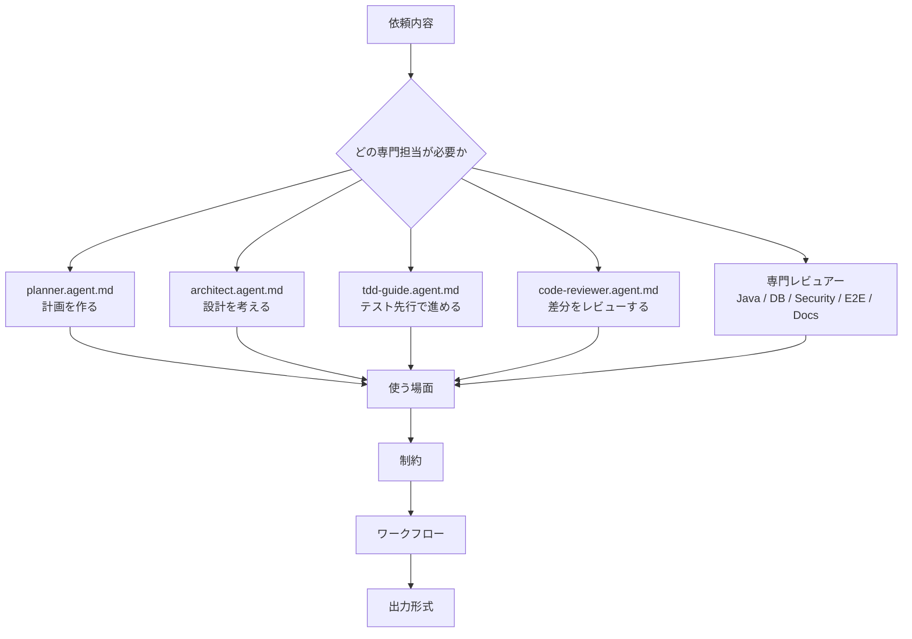
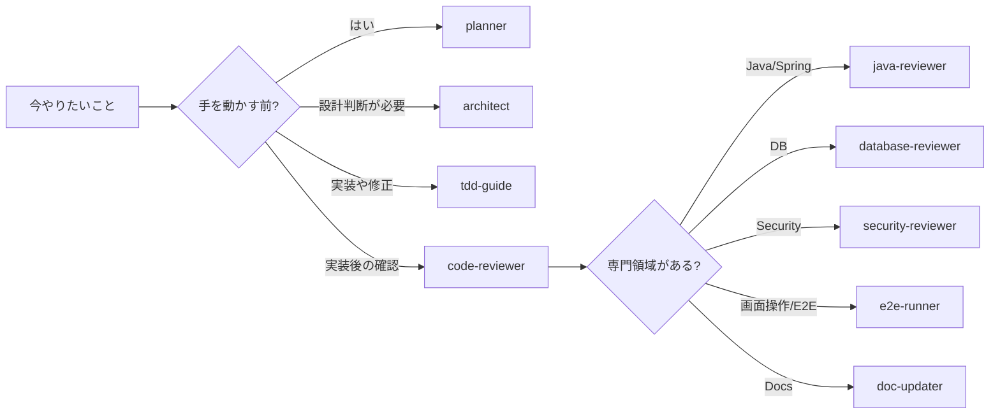

# agents ディレクトリ取扱説明書

`agents` は、GitHub Copilot に「専門担当者の役割」を渡すためのディレクトリです。ここにある `*.agent.md` は、実装そのものではなく、AI にどんな立場で考え、どんな順番で確認し、どんな形で返答してほしいかを書いた役割定義です。

人間のチームで言うと、アーキテクト、レビュアー、テスト担当、ドキュメント担当をファイルとして置いているイメージです。

## 全体像

## ファイルの見方

`*.agent.md` を開いたら、上から順に主に次の項目を見ます。

| 見る場所 | 何が書いてあるか | 読む目的 |
| --- | --- | --- |
| 先頭の `---` で囲まれた部分 | `name`、`description`、`tools` | 何というエージェントか、何の専門家か、読める/編集できる/実行できる道具は何かを見る |
| `# ...` の直後 | そのエージェントの役割説明 | AI にどんな立場で振る舞わせるかを見る |
| `## 使う場面` | そのエージェントを呼ぶ状況 | 今の作業に合う担当か判断する |
| `## 制約` と `## ワークフロー` | 守るべきこと、作業順序 | AI が勝手に広げたり、確認を飛ばしたりしないようにする |
| `## 出力形式` | 返答テンプレート | 最後にどんな報告を出すべきかを見る |

`tools` は、AI が使ってよい道具の目安です。たとえば `edit` があるエージェントはファイル編集を想定し、`execute` があるエージェントはテストやコマンド実行を想定しています。

## ファイル一覧

| ファイル | 担当 | ファイルに書いてあること | どこを見ればいいか |
| --- | --- | --- | --- |
| `architect.agent.md` | アーキテクチャ設計担当 | 新機能、大規模リファクタリング、技術選定、境界設計、データフロー設計を考えるエージェント。既存コードを読んでから、推奨案、代替案、採用しない案、トレードオフ、検証方針を整理する。 | まず `使う場面` で設計相談に合うか確認する。設計の品質を見たい時は `設計原則`、返答の形を確認したい時は `出力形式` を見る。 |
| `planner.agent.md` | 実行計画担当 | 複雑な実装、移行、リファクタリングを、調査、変更範囲、実装ステップ、テスト、リスクへ分解するエージェント。まだ手を動かす前に、何をどの順番でやるかを明確にする。 | 作業前なら `ワークフロー` を見る。計画の粒度を確認するなら `計画の品質基準`、計画書の構成を知りたいなら `出力形式` を見る。 |
| `tdd-guide.agent.md` | TDD支援担当 | 新機能、バグ修正、リファクタリングをテストファーストで進めるためのエージェント。期待動作を先に固定し、失敗テスト、最小実装、リファクタリング、検証まで進める。 | テスト先行で進めたい時は `ワークフロー` を見る。どんなテストを考えるかは `テスト観点`、最後の報告内容は `出力形式` を見る。 |
| `code-reviewer.agent.md` | 汎用コードレビュー担当 | ローカル差分やPR差分を、バグ、回帰、セキュリティ、保守性、テスト不足の観点でレビューするエージェント。好みの指摘より、実害のある問題を優先する。 | レビュー依頼なら `優先度` を見る。指摘の書き方を確認するなら `出力形式` の `Findings` を見る。 |
| `java-reviewer.agent.md` | Java / Spring Bootレビュー担当 | Java と Spring Boot のレイヤードアーキテクチャ、JPA、例外処理、トランザクション、セキュリティ、並行性を確認するエージェント。 | Java/Spring の変更後は `レビュー観点` を見る。重大度の分け方と返答形式は `出力形式` を見る。 |
| `database-reviewer.agent.md` | データベースレビュー担当 | PostgreSQL のスキーマ、クエリ、マイグレーション、RLS、インデックス、パフォーマンス、データ整合性を確認するエージェント。破壊的変更や本番データへの影響を重く扱う。 | DB変更時は `レビュー観点` を見る。マイグレーション案の書き方は `Suggested Migration Shape` を見る。 |
| `security-reviewer.agent.md` | セキュリティレビュー担当 | 認証、認可、入力検証、シークレット、依存関係、OWASP Top 10 を重点確認するエージェント。重大な問題は修正範囲やローテーション要否まで報告する。 | セキュリティ影響がある時は `重要チェック` を見る。報告形式は `Security Findings`、未確認事項は `未検証` を見る。 |
| `e2e-runner.agent.md` | E2Eテスト担当 | 重要なユーザーフローのE2Eテストを作成、実行、保守、失敗解析するエージェント。Playwright などで実際の利用者操作に近い確認を行う。 | 重要フローを守る時は `テスト設計観点` を見る。実行後の報告項目は `出力形式` を見る。 |
| `doc-updater.agent.md` | ドキュメント更新担当 | README、ガイド、コードマップ、API説明を、実コードに合わせて更新するエージェント。古い手順や未確認の前提を残さないことを重視する。 | ドキュメント更新時は `ワークフロー` を見る。コードマップを作る時は `コードマップの推奨構成` を見る。 |

## どれを選ぶか

迷ったら、最初に `planner.agent.md` で作業を分解し、実装後に `code-reviewer.agent.md` で差分を見る、という流れが使いやすいです。専門性が明確な場合だけ、Java、DB、Security、E2E、Docs の専門エージェントを使います。

## 注意点

- agent ファイルは「AIに役割を与える説明書」です。コードやテストそのものではありません。
- `description` は、どのエージェントを使うか判断するための短い説明です。
- `制約` は重要です。ここを読まずに使うと、AIが範囲を広げすぎたり、検証を飛ばしたりする可能性があります。
- `出力形式` は、レビューや計画をチームで読みやすくするための報告テンプレートです。
