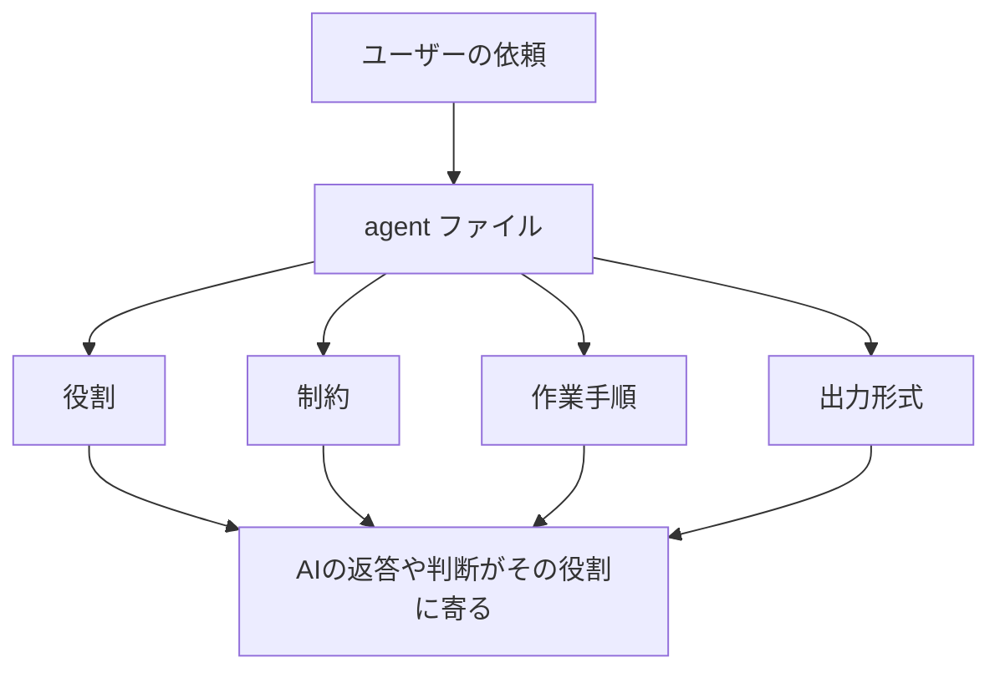
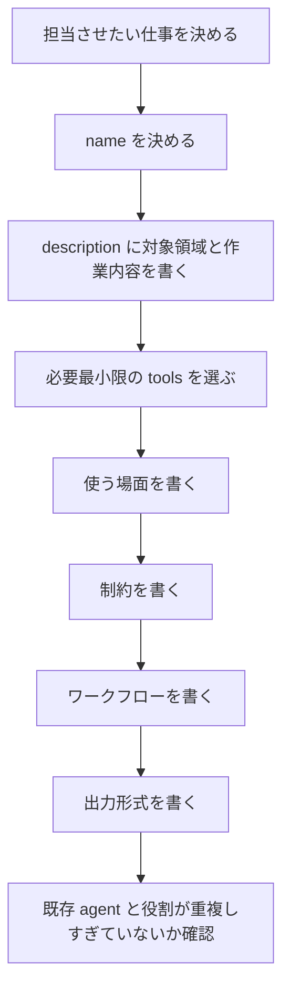

# agents ディレクトリ取扱説明書

`agents` は、AI に「専門担当者としての振る舞い」を教えるためのディレクトリです。ここに置く `*.agent.md` は、個別タスクの成果物ではなく、AI に渡す役割定義です。

エージェントファイルで決めるのは、主に次のことです。

- 何という担当者なのか
- どんな作業で呼ばれるべきか
- 何を読んで、何をしてよいか
- どんな順番で考えるべきか
- 最後にどんな形式で報告すべきか

## エージェントとは何か

通常のAIへの依頼は「この作業をして」という単発のお願いです。エージェントは、それより前に「あなたはレビュー担当です」「あなたは設計担当です」のような役割を定義します。



つまり、agent ファイルは「この仕事をこういう担当者として進めてください」とAIに伝える説明書です。

## 基本構造

`*.agent.md` は、大きく分けて2つの部分でできています。

```markdown
---
name: example-agent
description: 何をする専門担当かを短く説明する。
tools: [read, search, edit, execute]
---

# Example Agent

あなたは〇〇を担当するエージェントです。

## 使う場面

- こういう時に使う

## 制約

- 守るべきこと

## ワークフロー

1. 最初に確認すること
2. 次に判断すること
3. 最後に報告すること

## 出力形式

...
```

上の `---` で囲まれた部分がメタデータです。その下の本文が、AIへの具体的な指示です。

## メタデータの意味

| 項目 | 何を書くか | 書く理由 | AIへの効き方 |
| --- | --- | --- | --- |
| `name` | エージェントの短い名前。例: `code-reviewer` | 人間とAIがその担当者を識別するため | 呼び出す時の名前になり、役割の識別に使われる |
| `description` | 何の専門担当かを1文で書く | どの作業で使うべきか判断しやすくするため | AIや利用者が「この依頼に合う担当か」を判断しやすくなる |
| `tools` | 使ってよい道具の種類。例: `read`, `search`, `edit`, `execute`, `agent` | その担当者に許す行動範囲を明確にするため | 読むだけの担当、編集する担当、コマンド実行する担当を分けやすくなる |
| `model` | 必要な場合だけ、使うモデルを指定する項目 | 高度な推論が必要な担当や軽量でよい担当を分けたい時に使う | 未指定なら実行環境の既定に任せる。指定できる環境では、その担当の実行モデルを固定する |

このリポジトリの agent では、基本的に `name`、`description`、`tools` を使っています。`model` は必須ではありません。むやみに固定すると、利用環境を縛りやすくなるためです。

## `description` の書き方

`description` は、ただの説明文ではありません。「このエージェントをいつ使うか」を判断する入口です。

よい `description` は、次の3つを含みます。

- 対象領域: Java、DB、セキュリティ、ドキュメントなど
- 作業内容: 設計、レビュー、更新、検証など
- 重点観点: 品質、保守性、権限、回帰、実コードとの一致など

```markdown
description: 変更差分を品質、保守性、セキュリティ、テスト観点でレビューするコードレビュー専門エージェント。
```

このように書くと、「差分レビュー」「品質」「セキュリティ」「テスト」という依頼に反応しやすくなります。逆に、`便利なエージェントです` のように曖昧に書くと、どの場面で使えばよいか分かりません。

## `tools` の考え方

`tools` は、その担当者が何をしてよいかを示します。

| tool | 意味 | 向いている担当 |
| --- | --- | --- |
| `read` | ファイルを読む | ほぼ全ての担当 |
| `search` | コードや文書を検索する | 調査、レビュー、設計 |
| `edit` | ファイルを編集する | ドキュメント更新、テスト追加、修正担当 |
| `execute` | コマンドを実行する | テスト、ビルド、検証担当 |
| `agent` | 他のエージェント連携を想定する | 複雑な調査やレビューの取りまとめ |

書き方の目安は、「その担当が本当にやるべき行動だけを許す」です。レビュー専任なら `edit` を持たせない方が、勝手に修正せず指摘に集中できます。検証担当なら `execute` がないとテスト実行まで進めにくくなります。

## 本文に書くこと

本文は、AIがその担当者として動くための実務ルールです。よく使う見出しには、それぞれ意味があります。

| 見出し | 何を書くか | なぜ必要か |
| --- | --- | --- |
| `# ...` | 表示用のタイトル | 人間がファイルを開いた時に何の担当か分かるようにする |
| 冒頭文 | 「あなたは何の専門家か」 | AIの立場を最初に固定する |
| `## 使う場面` | どんな依頼で使うか | 呼ぶべき時と呼ばない時を分ける |
| `## 制約` | やってはいけないこと、必ず守ること | AIが勝手に範囲を広げたり、未確認で断言したりするのを防ぐ |
| `## ワークフロー` | 作業順序 | 調査、判断、実行、検証、報告の順番を固定する |
| `## レビュー観点` や `## 設計原則` | 専門領域ごとのチェック観点 | その担当者らしい判断基準を持たせる |
| `## 出力形式` | 報告テンプレート | 返答の形を揃え、チームが読みやすくする |

## なぜ制約を書くのか

AIは、指示が曖昧だと「良さそうなこと」を広くやろうとします。そのため、エージェントには制約を書きます。

例:

```markdown
## 制約

- 既存コードを読んでから提案する
- 根拠のない全面刷新を避ける
- 不明点は仮定として明記する
```

このように書くと、AIは「いきなり理想論を書く」のではなく、「まず既存コードを読む」「分からないことを分ける」という動きになりやすくなります。

## なぜ出力形式を書くのか

出力形式がないと、AIの報告は毎回ばらつきます。レビューでは指摘が後ろに埋もれたり、検証では何を実行したか分からなくなったりします。

```markdown
## 出力形式

## Findings
- [P1] 問題

## Checks
- 実行したコマンド: 結果

## Summary
短い総括
```

このように書くと、AIは「指摘を先に出す」「確認したことを書く」「最後に短くまとめる」という形を守りやすくなります。

## 作る時の手順



## 書き方の注意

- 1つの agent に何でもやらせないでください。担当が広すぎると、判断基準がぼやけます。
- `description` は短く具体的に書いてください。ここが曖昧だと、使いどころも曖昧になります。
- `tools` は多ければよいわけではありません。読むだけでよい担当に編集権限を持たせない方が安全です。
- `制約` には、失敗してほしくないことを明確に書きます。
- `ワークフロー` には、最初に読むもの、判断すること、最後に確認することを書きます。
- `出力形式` には、チームが欲しい報告の順番を書きます。
