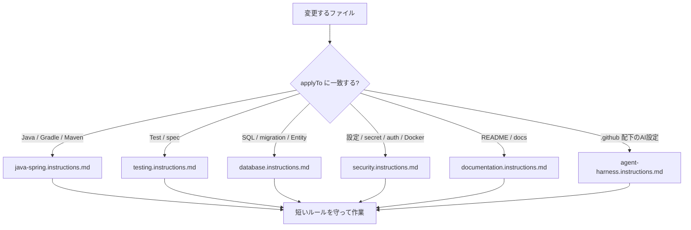
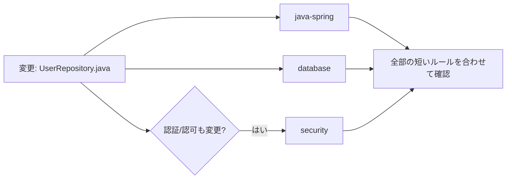

# instructions ディレクトリ取扱説明書

`instructions` は、特定の種類のファイルを扱う時に常に守ってほしいルールを置くディレクトリです。ここにある `*.instructions.md` は、毎回手動で読む長い手順書ではなく、「このパターンのファイルを触るなら、この注意を忘れないで」という短い常時ルールです。

たとえば Java ファイルを触る時は Java/Spring の指示、SQL や migration を触る時はデータベース指示、README を触る時はドキュメント指示を見る、という関係です。

## 全体像

## ファイルの見方

`*.instructions.md` を開いたら、最初に `applyTo` を見ます。

| 見る場所 | 何が書いてあるか | 読む目的 |
| --- | --- | --- |
| 先頭の `applyTo` | どのファイル名、拡張子、ディレクトリにこの指示が効くか | 今の作業に関係する指示か判断する |
| `# ... 指示` | 指示の種類 | Java、テスト、DB、セキュリティなどの分類を見る |
| 箇条書き | 守るべき短いルール | 作業中に忘れてはいけない確認事項を見る |

このディレクトリのファイルは短いです。詳細な手順は `agents`、`skills`、`prompts` に分け、ここには「常に守るべき基本ルール」だけを置く方針です。

## ファイル一覧

| ファイル | 対象になる主なファイル | ファイルに書いてあること | どこを見ればいいか |
| --- | --- | --- | --- |
| `agent-harness.instructions.md` | `.github/agents/**`、`.github/skills/**`、`.github/prompts/**`、`.github/instructions/**`、`.github/copilot-instructions.md` | Copilot 用の agents、skills、prompts、instructions を作る時の配置ルールと分担。repository-wide 指示は `copilot-instructions.md`、path-specific 指示は `instructions`、詳細手順は agents/skills/prompts に分ける、と書いてある。 | 先頭の `applyTo` で `.github` 配下のAI設定が対象か確認する。箇条書きの後半で、agents、skills、prompts それぞれに何を書くべきかを見る。 |
| `database.instructions.md` | `*.sql`、`migrations/**`、`db/**`、`schema/**`、`*Entity.java`、`*Repository.java` など | 本番DB変更は migration で管理する、適用済み migration は編集しない、大きなテーブルではロックや全件更新を確認する、Repository の N+1 やページング漏れを見る、といったDB作業の基本ルール。 | migration を触るなら先頭から読む。Entity/Repository を触る時は、後半の Repository と Entity に関する箇条書きを見る。 |
| `documentation.instructions.md` | `*.md`、`*.mdx`、`README*`、`docs/**` | 読者が必要な結論を先に書く、現在の構成やコマンドと一致させる、古いツール名や未確認の前提を残さない、公開できない情報を書かない、というドキュメント作成ルール。 | README や docs を更新する前に全部読む。特に「実コードと矛盾しないか」「公開できない情報がないか」を確認する。 |
| `java-spring.instructions.md` | `*.java`、`pom.xml`、`build.gradle`、`settings.gradle` など | Spring Boot の Controller、Service、Repository、DTO の責務分離、コンストラクタインジェクション、Bean Validation、トランザクション境界、APIレスポンス、例外処理、既存規約への合わせ方。 | Java実装では全体を読む。特に Controller/Service/Repository の分担と、入力検証、トランザクション、例外処理の箇条書きを見る。 |
| `security.instructions.md` | Java、JS/TS、Python、SQL、YAML、properties、`.env.example`、Dockerfile、config/security 配下など | APIキーや個人情報をコミットしない、外部入力を検証する、SQLはパラメータ化する、未サニタイズ入力をHTML/Markdown/log/errorに出さない、認証認可やCORSなどを再確認する、というセキュリティの常時ルール。 | 設定、認証、入力、ログ、Docker、環境変数を触る時に読む。秘密情報と外部入力に関する前半の箇条書きは特に重要。 |
| `testing.instructions.md` | `*Test.java`、`*Tests.java`、`*IT.java`、`src/test/**`、`tests/**`、`*spec.*`、`*test.*`、build設定 | 新機能やバグ修正では先に期待動作や再現条件をテストで固定する、テストを独立させる、カバレッジ数値だけで完了判断しない、実行コマンドと未実行理由を報告する、というテスト作業の基本ルール。 | テスト追加や修正時に全部読む。完了報告前には最後の「実行したコマンド、結果、未実行の理由」を確認する。 |

## 重なった時の考え方

1つの作業に複数の instructions が当たることがあります。たとえば `UserRepository.java` を変更するなら、`java-spring.instructions.md` と `database.instructions.md` の両方が関係します。認可条件も変えるなら `security.instructions.md` も関係します。

## 注意点

- instructions は「常時の短い注意書き」です。作業の細かい手順は `skills` や `prompts` を見ます。
- `applyTo` がいちばん重要です。ここを見れば、その指示がどのファイルに関係するか分かります。
- ファイルが短いので、対象に当たるものは部分読みではなく全体を読んだ方が安全です。
