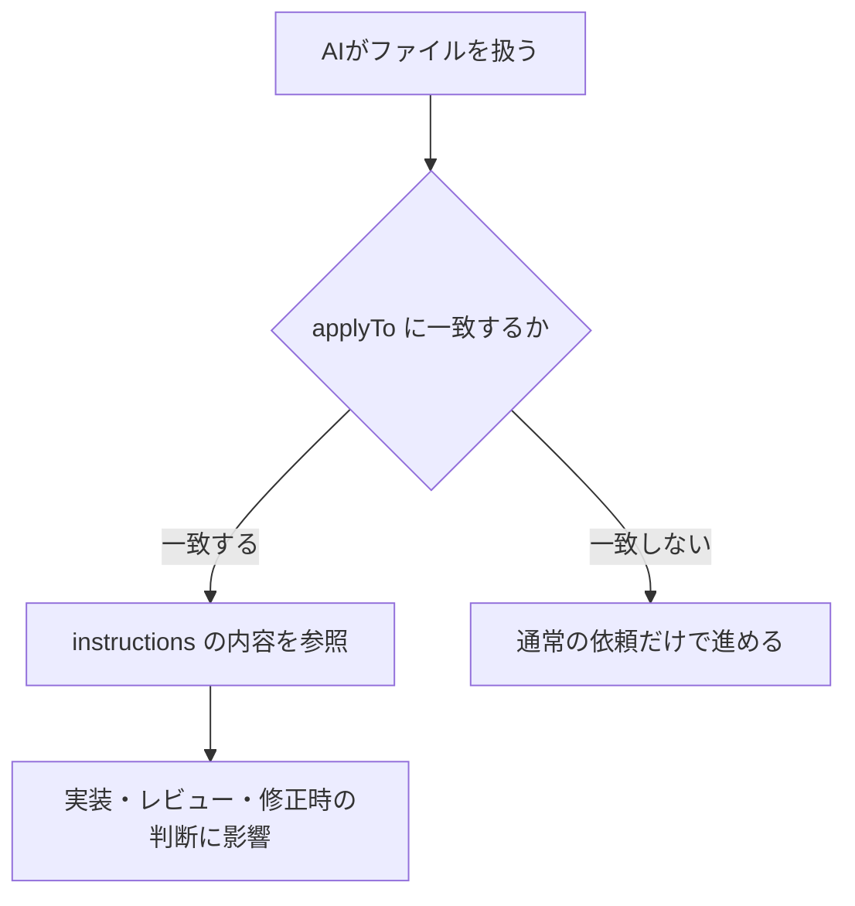
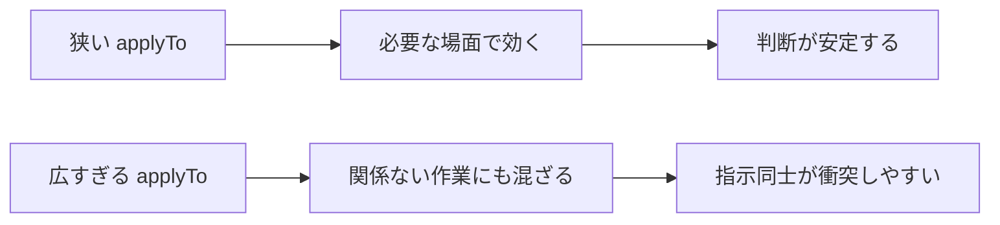
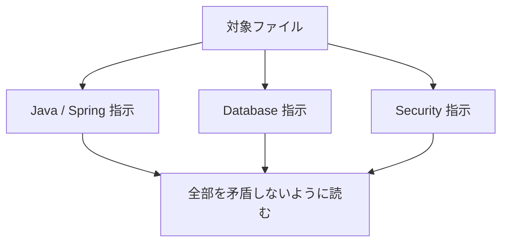

# instructions ディレクトリ取扱説明書

`instructions` は、特定のファイルやディレクトリを扱う時に、AIへ常に守ってほしいルールを書く場所です。ここに置く `*.instructions.md` は、個別の作業依頼ではありません。対象ファイルに対する基本方針を、短く、継続的に効かせるための説明書です。

たとえば、Javaファイルを触る時の責務分離、テストファイルを触る時のテスト方針、READMEを触る時の書き方などをここに書きます。

## instructions とは何か

instructions は「この種類のファイルを扱うなら、常にこのルールを意識して」という補助ルールです。



`agents` が専門担当者、`prompts` が依頼テンプレート、`skills` が手順書だとすると、`instructions` は対象ファイルにかかる常時ルールです。

## 基本構造

```markdown
---
applyTo: "**/*.java,**/pom.xml"
---

# Java / Spring 指示

- Spring Boot では Controller、Service、Repository、DTO の責務を分ける。
- 外部入力は Controller 境界で検証する。
- 例外やログに機密情報を含めない。
```

上の `---` で囲まれた部分がメタデータです。本文は短い箇条書きで、守るべきルールを書きます。

## メタデータの意味

| 項目 | 何を書くか | 書く理由 | AIへの効き方 |
| --- | --- | --- | --- |
| `applyTo` | この指示を適用するファイルパターン | どのファイルにこのルールを効かせるか決めるため | 一致するファイルを扱う時に、この指示が参照されやすくなる |

このディレクトリでは、基本的に `applyTo` が最重要です。`name` や `description` ではなく、「どのファイルに効くか」を先頭で決めます。

## `applyTo` の読み方

`applyTo` は、ファイル名やディレクトリに対するパターンです。

```yaml
applyTo: "**/*.java,**/pom.xml,**/build.gradle"
```

この例は、次のような意味です。

- `**/*.java`: どの階層にある Java ファイルにも当たる
- `**/pom.xml`: どの階層にある Maven 設定にも当たる
- `**/build.gradle`: どの階層にある Gradle 設定にも当たる

カンマで複数のパターンを並べると、どれかに一致した時にその指示の対象になります。

## `applyTo` を広くしすぎない

`applyTo` が広すぎると、関係ない作業にもルールがかかります。たとえばセキュリティ指示を全ファイルに広げすぎると、普通のドキュメント修正でも過剰にセキュリティ観点へ寄る可能性があります。



ルールは「必要な場所にだけ効く」ように書くのが基本です。

## 本文に書くこと

instructions の本文は、長い手順ではなく、常に守る短い原則を書きます。

| 書く内容 | 例 | 書く理由 |
| --- | --- | --- |
| 守るべき設計方針 | Controller と Service の責務を分ける | 実装の方向性を揃える |
| セキュリティ上の禁止事項 | APIキーやパスワードをコミットしない | 重大事故を防ぐ |
| テストの基本姿勢 | バグ修正では再現テストを先に作る | 修正の妥当性を確認する |
| ドキュメントの書き方 | 古いコマンドや未確認の前提を残さない | 読者が迷わないようにする |
| 完了報告で必要なこと | 実行したコマンドと未実行理由を書く | 検証済みと未検証を分ける |

## なぜ短く書くのか

instructions は、対象ファイルを扱うたびに効く可能性があります。そのため、長すぎるとノイズになります。

悪い例:

```markdown
- Java の歴史、Spring Boot の思想、詳しい設計パターンを長文で説明する。
```

よい例:

```markdown
- Spring Boot では Controller、Service、Repository、DTO の責務を分ける。
```

詳しい手順や専門知識は `skills` に置き、instructions には「いつも忘れてほしくないこと」だけを書きます。

## ルールが重なった時

1つのファイルに複数の instructions が当たることがあります。たとえば Java の Repository を触る時は、Java/Spring の指示とデータベースの指示が同時に関係します。



重なった場合は、どれか1つだけを見るのではなく、関係する短いルールを合わせて読みます。矛盾しそうな場合は、より安全側のルールや、ユーザーの明示指示を優先します。

## 作る時の手順

1. どの種類のファイルに効かせたいか決める。
2. `applyTo` に対象パターンを書く。
3. 本文には短い箇条書きで常時ルールを書く。
4. 詳しい作業手順になってきたら `skills` に分ける。
5. 特定の担当者の振る舞いになってきたら `agents` に分ける。
6. 繰り返し使う依頼文になってきたら `prompts` に分ける。

## 書き方の注意

- instructions は「常時ルール」です。長い作業手順を詰め込みすぎないでください。
- `applyTo` は狭すぎても効かず、広すぎてもノイズになります。
- 箇条書きは、AIが行動に移せる表現にします。
- 「品質を高くする」のような抽象語だけではなく、「実行したコマンドと未実行理由を書く」のように具体化します。
- 他の instructions と矛盾するルールを書かないようにします。
