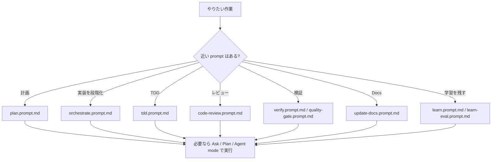
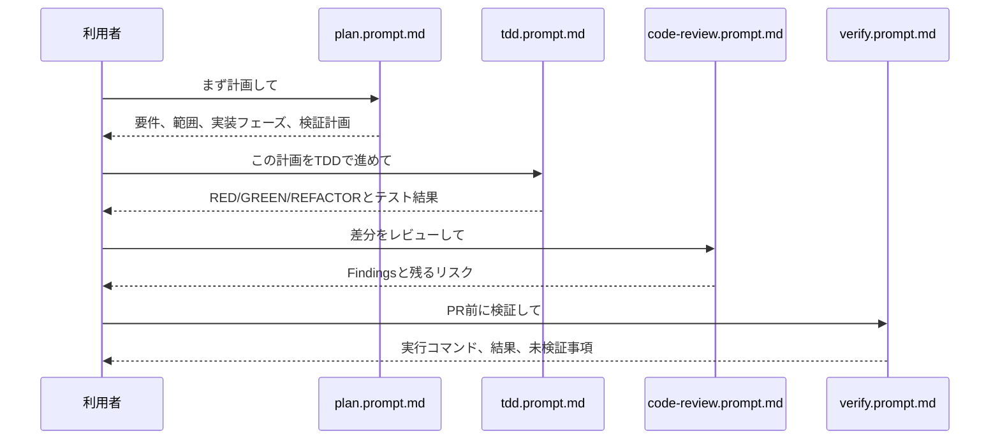

# prompts ディレクトリ取扱説明書

`prompts` は、何度も使う依頼文を `*.prompt.md` として置くディレクトリです。ここにあるファイルは custom agent ではありません。AI の役割を固定するものではなく、「こういう作業を頼む時は、この依頼文を使う」と決めておくためのテンプレートです。

人間向けに言うと、毎回ゼロから依頼文を書く代わりに使う作業依頼フォームです。

## 全体像

この図は代表的な使い分けです。すべての prompt は後ろの「ファイル一覧」で説明しています。

## ファイルの見方

`*.prompt.md` を開いたら、上から順に見ます。

| 見る場所 | 何が書いてあるか | 読む目的 |
| --- | --- | --- |
| 先頭の `description` | 何を頼む prompt か | ファイルを選ぶ時の判断材料にする |
| `# ...` | prompt の名前 | 画面で探す時の見出しにする |
| `## 入力`、`## モード`、`## 分析対象` など | 実行時に指定するもの | どんな言葉を足して使うかを確認する |
| `## 手順`、`## ワークフロー` | AI に進めてほしい順番 | 作業の流れを見る |
| `## 出力` | 最後に返してほしい報告項目 | 報告に何が含まれるかを見る |

このパックでは、prompt を軽量で移植しやすくするため、frontmatter は基本的に `description` だけにしています。`.prompt.md` に `agent` や `tools` を固定すると実行環境や利用者の意図を強く縛るため、ここでは固定していません。特定のリポジトリで実行先を固定したい場合だけ、対象 prompt に追加してください。

## ファイル一覧

| ファイル | 何を頼む prompt か | ファイルに書いてあること | どこを見ればいいか | 推奨実行先 |
| --- | --- | --- | --- | --- |
| `checkpoint.prompt.md` | 作業状態のチェックポイント作成、比較、一覧化 | `create <name>`、`verify <name>`、`list`、`clear` の入力、記録や比較の手順、差分ファイル数や検証結果の出力項目。 | 使う前に `入力` を見る。実際の流れは `手順`、報告項目は `出力` を見る。 | Agent mode |
| `code-review.prompt.md` | 未コミット変更のレビュー | セキュリティ、品質、テスト観点のレビュー項目、差分確認、関連テスト、Findings first の出力ルール。 | 何を指摘するかは `レビュー観点`、進め方は `手順`、報告形式は `出力` を見る。 | Agent mode、または `code-reviewer` custom agent |
| `e2e.prompt.md` | 重要ユーザーフローのE2Eテスト作成、実行、報告 | 対象フローの確認、Playwright などでのテスト追加、実行、artifact、失敗時の原因と次の修正案。 | 実行前に `手順` を見る。最後に必要な情報は `出力` を見る。 | Agent mode、または `e2e-runner` custom agent |
| `learn-eval.prompt.md` | セッションから知見を抽出し、保存前に評価 | エラー解決、デバッグ手順、回避策、プロジェクト固有知識の抽出対象、保存すべきかの評価軸、下書き出力。 | 何を知見として扱うかは `抽出対象`、保存判断は `評価`、保存前の形は `出力` を見る。 | Ask mode |
| `learn.prompt.md` | 作業セッションから再利用可能なパターンを下書き化 | 非自明なエラー原因、調査手順、規約、検証の型を抽出し、単純な typo などは除外する。 | 残すものは `抽出するもの`、残さないものは `除外するもの`、下書き形式は `出力` を見る。 | Ask mode |
| `orchestrate.prompt.md` | 複雑なタスクをフェーズに分けて進める | `feature`、`bugfix`、`refactor`、`security` のワークフロー、調査、計画、実装、レビュー、検証の進め方。 | 作業タイプ別の流れは `ワークフロー`、共通手順は `手順`、最後の報告は `出力` を見る。 | Agent mode |
| `plan.prompt.md` | 要件整理と段階的な実装計画 | 要件、対象範囲、対象外、実装フェーズ、リスク、検証計画、編集前の確認質問。 | まず `手順` を見る。計画書に何が含まれるかは `出力` を見る。 | Plan mode |
| `quality-gate.prompt.md` | フォーマット、lint、型、テストの品質ゲート | 対象範囲、`--fix`、`--strict` の入力、実行コマンドの選定、PASS/FAIL、自動修正有無、残る問題。 | オプションは `入力`、実行順は `手順`、報告項目は `出力` を見る。 | Agent mode |
| `skill-create.prompt.md` | Git履歴と既存コードからスキル文書案を作る | コミットメッセージ、同時変更ファイル、フォルダ構成、テスト配置、リリース運用を分析し、スキル案と確認質問を出す。 | 何を分析するかは `分析対象`、生成までの流れは `手順`、レビュー用の情報は `出力` を見る。 | Agent mode |
| `tdd.prompt.md` | 失敗テストから始めるTDD | RED、GREEN、REFACTOR の流れ、追加/変更したテスト、失敗内容、成功結果、未検証ケースの出力。 | TDDの進め方は `手順`、報告で必要なものは `出力` を見る。 | Agent mode、または `tdd-guide` custom agent |
| `test-coverage.prompt.md` | テストカバレッジ分析と不足ケース追加 | カバレッジ実行、低カバレッジ箇所の確認、不足テスト追加、前後のカバレッジ、未検証リスク。 | どの順番で確認するかは `手順`、報告項目は `出力` を見る。 | Agent mode |
| `update-docs.prompt.md` | 開発ドキュメント更新 | `package.json`、`.env.example`、CI、Docker、既存docsなど信頼できる情報源を見て、古い手順や不足手順を更新する。 | 参照すべき根拠は `信頼する情報源`、更新手順は `手順`、報告項目は `出力` を見る。 | Agent mode、または `doc-updater` custom agent |
| `verify.prompt.md` | PR準備状況の確認 | `quick`、`full`、`pre-commit`、`pre-pr` のモード、ビルド、型、lint、テスト、ログ監査、Git状態の確認。 | どの深さで確認するかは `モード`、実行順は `手順`、報告形式は `出力` を見る。 | Agent mode |

## よく使う流れ

## 注意点

- prompt は「依頼文」です。AIの専門人格を定義するものは `agents` を見ます。
- prompt は自動で必ず実行されるルールではありません。常時ルールは `instructions` を見ます。
- prompt の中身を見る時は、`手順` だけでなく `出力` も確認してください。最後に何を報告すべきかが分かります。
- 迷った時は `plan.prompt.md` で作業を整理してから、必要に応じて `tdd`、`code-review`、`verify` に進むと読みやすい流れになります。
