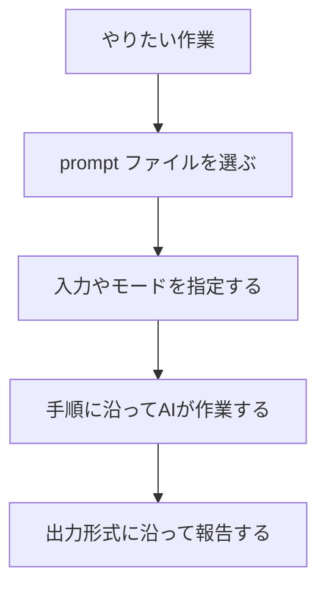
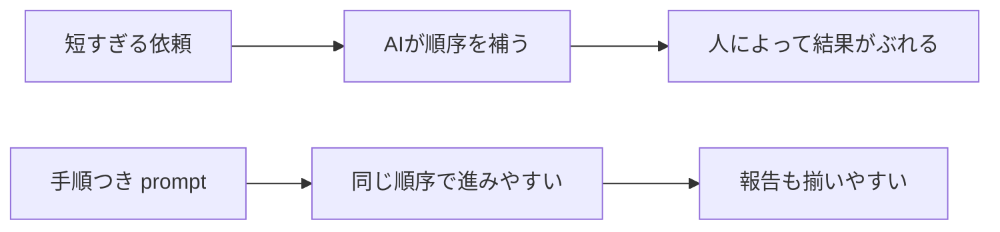

# prompts ディレクトリ取扱説明書

`prompts` は、何度も使う依頼文を置くディレクトリです。ここにある `*.prompt.md` は、AIの専門担当者を定義するものではなく、「この作業を頼む時は、この流れで依頼する」という再利用可能な依頼テンプレートです。

毎回ゼロから長い依頼を書く代わりに、作業の入口として使います。

## prompt とは何か

prompt は、AIに対する作業依頼です。`*.prompt.md` にしておくと、同じ種類の作業をチームで同じ形で頼みやすくなります。



`prompts` は「実行する依頼文」です。常時ルールを書く `instructions` や、専門担当を定義する `agents` とは役割が違います。

実ファイルの冒頭にある `This is a reusable VS Code prompt file, not a custom agent...` という文は、「これは agent 定義ではなく、チャットから手動で選んで使う依頼テンプレートです」という意味です。つまり、このファイルを置くだけでAIの人格が変わるのではなく、利用者がその prompt を選んだ時に依頼文として使われます。

## 基本構造

```markdown
---
description: 要件を整理し、リスクと段階的な実装計画を提示します。
---

# Plan

この prompt では、作業前に要件、範囲、リスク、検証方針を整理します。

## 入力

- 対象:
- 制約:

## 手順

1. 要件を整理する。
2. 対象範囲と対象外を分ける。
3. 実装フェーズに分ける。
4. 検証計画を書く。

## 出力

- 要件の再整理
- 対象範囲と対象外
- 実装フェーズ
- 検証計画
```

## メタデータの意味

| 項目 | 何を書くか | 書く理由 | AIへの効き方 |
| --- | --- | --- | --- |
| `description` | その prompt で何を頼むかを短く書く | 利用者が prompt を選びやすくするため | 作業内容の入口として読まれ、どの依頼テンプレートか判断しやすくなる |
| `mode` | 必要な場合だけ、Ask / Plan / Agent などの実行モードを指定する | 実行方法を固定したい時に使う | 未指定なら利用者が場面に応じて選べる |
| `tools` | 必要な場合だけ、使う道具を指定する | コマンド実行や編集などを前提にしたい時に使う | 未指定なら実行環境や利用者の選択に任せる |

このリポジトリでは、prompt を移植しやすくするため、基本的に `description` だけを書いています。`mode` や `tools` を固定すると便利な場面もありますが、使う環境や利用者の意図を縛りやすくなります。

## 本文に書くこと

prompt の本文は、「どう頼むか」と「どう返してほしいか」を書きます。

| 見出し | 何を書くか | なぜ必要か |
| --- | --- | --- |
| `# ...` | prompt の名前 | 人間がどの依頼テンプレートか分かるようにする |
| 冒頭文 | この prompt の目的 | AIに作業のゴールを伝える |
| `## 入力` | 利用者が追加で指定する値 | 対象、モード、オプションを明確にする。必要な prompt だけに置く |
| `## モード` | 実行の深さや種類 | quick / full など、作業の重さを選べるようにする。必要な prompt だけに置く |
| `## 手順` | AIに進めてほしい順番 | 調査、実行、確認、報告の流れを固定する。多くの prompt で中心になる |
| `## 出力` | 最後に返してほしい項目 | 報告の抜け漏れを防ぐ。多くの prompt で中心になる |

## `入力` を書く意味

prompt は再利用されるため、毎回変わる情報があります。たとえば対象ファイル、対象機能、実行モード、修正を許可するかどうかです。

ただし、すべての prompt に `入力` が必要なわけではありません。指定する値が少ない prompt では、`入力` 見出しを置かず、本文や `手順` の中で必要な情報を説明してもかまいません。

```markdown
## 入力

- 対象: 指定がなければ現在の作業範囲
- `--fix`: 安全な自動修正を許可
- `--strict`: 警告も失敗扱いにする
```

このように書くと、利用者は「何を追加で指定すればよいか」が分かります。AIも、指定がない時の扱いを判断しやすくなります。

## `手順` を書く意味

AIは、依頼が短いと作業順序を自分で補います。補った順序がチームの期待と違うと、調査不足や検証不足が起きます。



そのため、prompt には「最初に何を見るか」「次に何をするか」「最後に何を報告するか」を書きます。

## `出力` を書く意味

出力項目は、作業完了時に必要な報告チェックリストです。

例:

```markdown
## 出力

- 対象範囲
- 実行したコマンド
- PASS/FAIL
- 残る問題と次のアクション
```

これがあると、AIは単に「完了しました」と言うのではなく、何を確認し、何が残っているかを分けて報告しやすくなります。

## runner を固定しない考え方

prompt は、Ask、Plan、Agent、custom agent など、実行先を選んで使える依頼テンプレートです。最初から runner や tools を固定すると、利用者がその場で選びにくくなります。

このリポジトリでは、共有しやすさを優先して、基本的に runner を固定していません。

固定した方がよいのは、次のような場合です。

- 必ずコマンド実行が必要
- 必ずファイル編集が必要
- その prompt を特定の custom agent とだけ組み合わせたい
- チーム内で実行モードを統一したい

## 作る時の手順

1. 何度も使う依頼か確認する。
2. `description` に、何を頼む prompt か1文で書く。
3. 冒頭で、この prompt の目的を書く。
4. 毎回変わる情報を `入力` に書く。
5. AIに守ってほしい進め方を `手順` に書く。
6. 最後に欲しい報告を `出力` に書く。
7. 必要な場合だけ `mode` や `tools` を固定する。

## 書き方の注意

- prompt は「依頼テンプレート」です。専門担当の人格や役割を細かく定義したい場合は `agents` に分けます。
- 常に守る短いルールを書きたい場合は `instructions` に分けます。
- 詳しい専門手順を書きたい場合は `skills` に分けます。
- `手順` と `出力` をセットで書くと、作業の流れと報告の形が揃いやすくなります。
- 1つの prompt に複数の目的を詰め込みすぎないでください。
