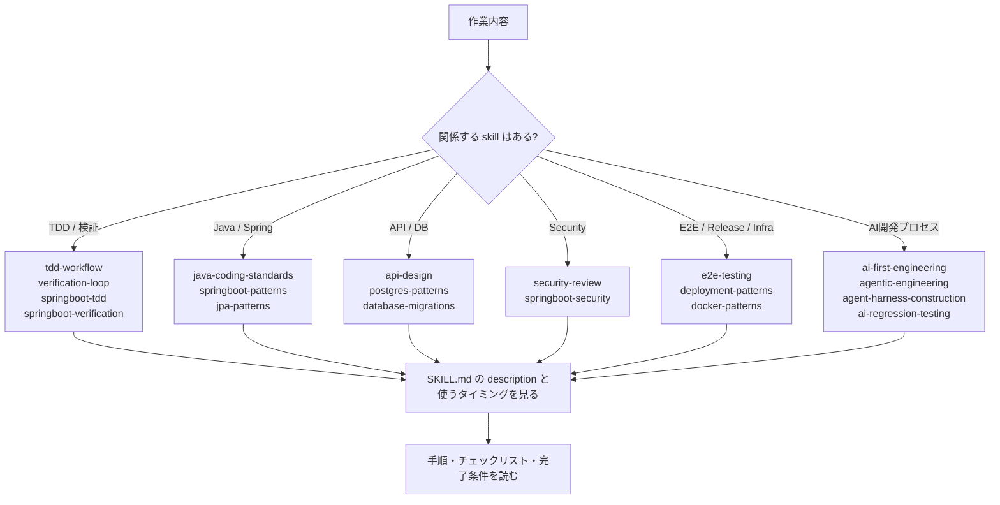

# skills ディレクトリ取扱説明書

`skills` は、AI に作業の進め方や専門知識を渡すための手順書ディレクトリです。各フォルダに `SKILL.md` が1つずつあり、そこに「いつ使うか」「何を確認するか」「どう完了判断するか」が書かれています。

`instructions` が常時ルール、`prompts` が依頼文、`agents` が専門担当者だとすると、`skills` は作業中に参照する専門マニュアルです。

## 全体像

## ファイルの見方

各フォルダの中にある `SKILL.md` を開き、次の順番で読みます。

| 見る場所 | 何が書いてあるか | 読む目的 |
| --- | --- | --- |
| フォルダ名 | skill の短い名前 | どの分野の手順書か大まかに判断する |
| 先頭の `name` | skill の正式名 | AI が参照する名前を確認する |
| 先頭の `description` | いつ使う skill か | 今の作業に合うか判断する |
| `# ...` の直後 | skill の概要 | その手順書の目的を理解する |
| `## 使うタイミング` など | 使用する場面 | 呼ぶべき状況を確認する。`使うタイミング` がない場合は `description` と最初の本文見出しを見る |
| `## Checklist`、`## Review checklist`、`## 完了条件` など | 確認項目 | 作業やレビューで見るべきポイントを確認する |
| `## Commands`、`## Report` など | 実行コマンドや報告形式 | 最後に何を実行し、どう報告するかを見る |

`description` は特に重要です。AI が「この作業ではどの skill が関係しそうか」を判断するための短い説明になっています。

## 収録方針

- `SKILL.md` は、必要な時に読むオンデマンド手順に限定する。
- 常時適用したい規約や品質ゲートは、skill ではなく `instructions` 側へ置く。
- Java / Spring Boot / PostgreSQL / API / Docker / deployment / verification に直結するものを優先する。
- 旧環境固有のインストールパス、hook lifecycle、専用 tool 名、model 名、subagent 実行前提は持ち込まない。

## ファイル一覧

| フォルダ / ファイル | 分野 | ファイルに書いてあること | どこを見ればいいか |
| --- | --- | --- | --- |
| `agent-harness-construction/SKILL.md` | AI agent の実行基盤 | AI agent の tool 設計、observation、recovery contract、context budget、ベンチマーク設計。AIが途中で迷子にならず、失敗時に復帰でき、検証可能な形で動くための設計。 | agent の道具や実行基盤を作る時は `Tool設計`、実行結果の見せ方は `Observation contract`、失敗復旧は `Error recovery`、長い作業の情報量管理は `Context budget` を見る。 |
| `agentic-engineering/SKILL.md` | AI に任せる作業分解 | AI agent に調査や実装を任せる作業を、eval-first、検証可能な小単位、コスト意識のある進め方へ分解する手順。依頼テンプレートも含む。 | まず `使うタイミング` を見る。作業設計は `Eval-first loop` と `タスク分解`、AIへの頼み方は `Agentへの依頼テンプレート` を見る。 |
| `ai-first-engineering/SKILL.md` | AI中心の開発運用 | AI が実装量を大きく担うチームで、計画、レビュー、テスト、ロールアウトを品質中心に設計する考え方。module boundary、contract、validation、rollback、monitoring も扱う。 | チーム運用を考える時は `運用原則`、AIが変更しやすい構造は `Agent-friendly architecture`、完了判断は `完了の基準` を見る。 |
| `ai-regression-testing/SKILL.md` | AI生成変更の回帰防止 | AI生成変更で起きやすい回帰を、再現テスト、contract test、複数コードパス検証で固定する手順。sandbox/mock/production path のズレなどを扱う。 | 回帰防止なら `基本手順` を見る。AI変更で起きがちな問題は `よくあるAI回帰`、API互換性は `Contract testの観点` を見る。 |
| `api-design/SKILL.md` | REST API設計 | REST API の resource 設計、HTTP status、response 形式、pagination、filtering、error response、versioning の設計とレビュー。 | APIを追加/変更する時は `Resource設計`、ステータスコードは `HTTP status`、レスポンス構造は `Response形式`、一覧APIは `Pagination` を見る。 |
| `database-migrations/SKILL.md` | 本番DB変更 | production database の schema change、data migration、rollback、zero-downtime deployment、expand-contract pattern。PostgreSQL と Spring Boot/JPA の注意も含む。 | migration 設計では `原則` と `安全チェック` を見る。破壊的変更を段階化する時は `Expand-contract pattern` を見る。 |
| `deployment-patterns/SKILL.md` | デプロイ / リリース | CI/CD、deployment strategy、health check、rollback、production readiness。blue-green、canary、feature flag、release report などを扱う。 | リリース方式は `Strategy選択`、本番投入前は `Readiness checklist`、CIで止める条件は `CI/CD gate`、報告は `Release report` を見る。 |
| `docker-patterns/SKILL.md` | Docker / Compose | Dockerfile、Docker Compose、container security、networking、volume、multi-service local development。Java/Spring Boot のコンテナ注意点もある。 | Dockerfile は `Dockerfile原則`、Compose は `Compose原則`、安全性は `Security checklist`、起動しない時は `Troubleshooting` を見る。 |
| `e2e-testing/SKILL.md` | E2Eテスト | Playwright を中心に、E2Eテスト、Page Object、CI artifact、flaky対策、user journey 検証を設計する手順。 | 重要フローを守る時は `テスト設計`、Playwright設定は `Playwright設定の要点`、不安定なテスト対策は `Flaky対策` を見る。 |
| `java-coding-standards/SKILL.md` | Javaコーディング規約 | Java 17+ と Spring Boot サービスで、読みやすく型安全で保守しやすいコードを書く/レビューするための原則。命名、Optional、例外、Stream、Project layout、レビュー項目。 | コードを書く時は `原則`、命名は `Naming`、null/戻り値は `Optional`、エラー処理は `Exception`、最後の確認は `Review checklist` を見る。 |
| `jpa-patterns/SKILL.md` | JPA / Hibernate | Entity、Repository、transaction、query performance、N+1、Testcontainers 検証。永続化層の設計とレビューを扱う。 | Entity設計は `Entity設計`、クエリは `Repository`、性能問題は `N+1対策`、トランザクションは `Transaction` を見る。 |
| `postgres-patterns/SKILL.md` | PostgreSQL | PostgreSQL の schema、index、query、RLS、timeout、pooling、migration safety。型選択やインデックス設計、運用面の注意。 | 型は `Data type`、検索性能は `Index` と `Query pattern`、権限やRLSと運用設定は `Security / operation` を見る。 |
| `security-review/SKILL.md` | セキュリティレビュー | 認証、認可、入力検証、secret、API、依存関係、cloud/CI設定を変更する時のセキュリティチェックリスト。 | まず `使うタイミング` を見る。詳細確認は `Checklist` の Secret、Input validation、Authn/Authz、Injection、Web security、Dependency、Cloud/infra を見る。 |
| `springboot-patterns/SKILL.md` | Spring Boot設計 | Controller、Service、Repository、DTO、validation、caching、async、logging の設計とレビュー。Spring Boot の層分けと運用観点を扱う。 | 層分けは `Layering`、API入口は `Controller`、業務処理は `Service`、設定は `Configuration`、ログ/監視は `Observability` を見る。 |
| `springboot-security/SKILL.md` | Spring Security | Spring Boot / Spring Security の認証、認可、CSRF、headers、rate limit、secret、dependency security。 | JWT/session は `Authentication`、権限は `Authorization`、入力と出力は `Input / output`、CORS/CSRFは `Headers / CORS / CSRF` を見る。 |
| `springboot-tdd/SKILL.md` | Spring Boot TDD | JUnit 5、Mockito、MockMvc、DataJpaTest、Testcontainers を使ったTDD。Unit、Web、Persistence、Integration のテスト選択も書いてある。 | TDDの流れは `Loop`、テスト種別は `Test種類`、fixtureや時刻制御は `Test data`、実行コマンドは `Commands` を見る。 |
| `springboot-verification/SKILL.md` | Spring Boot検証 | PR前またはリリース前に build、static analysis、test、coverage、security scan、diff review を行う手順。Maven/Gradle のコマンド例もある。 | 検証段階は `Verification phases`、コマンドは `Commands`、差分確認は `Diff review`、失敗時の扱いは `失敗時` を見る。 |
| `tdd-workflow/SKILL.md` | 技術非依存TDD | 新機能、bug fix、refactor で、失敗するテストから始め、最小実装、refactor、coverage 確認まで進める一般TDD手順。 | 進め方は `Loop`、テスト種別は `Test選択`、バグ修正時の固定方法は `Bug fixの場合`、避けるべき進め方は `Anti-pattern` を見る。 |
| `verification-loop/SKILL.md` | 一般検証ループ | 変更後やPR前に、build、type/static check、lint、test、security、runtime smoke、diff review を順に行い、検証済みと未検証を分けて報告する手順。 | 検証順は `Phases`、コマンド選択は `Command選択`、差分確認は `Diff review`、報告形式は `Report` を見る。 |

## 用途別の探し方

| やりたいこと | 見る skill |
| --- | --- |
| まずTDDで進めたい | `tdd-workflow`、Spring Bootなら `springboot-tdd` |
| 変更後に検証したい | `verification-loop`、Spring Bootなら `springboot-verification` |
| Java/Spring の実装規約を確認したい | `java-coding-standards`、`springboot-patterns` |
| DBや永続化を触る | `jpa-patterns`、`postgres-patterns`、`database-migrations` |
| APIを設計する | `api-design` |
| セキュリティ影響を見る | `security-review`、Spring Securityなら `springboot-security` |
| E2Eテストを作る | `e2e-testing` |
| Dockerやデプロイを確認する | `docker-patterns`、`deployment-patterns` |
| AIに任せる開発プロセスを整える | `ai-first-engineering`、`agentic-engineering`、`agent-harness-construction`、`ai-regression-testing` |

## 注意点

- skill は「必要な時に読む手順書」です。常に適用される短いルールは `instructions` を見ます。
- skill はコードそのものではありません。実装やレビューの時に、AIや人が見る観点をまとめたものです。
- `description` と `使うタイミング` を見れば、その skill を使うべき場面が分かります。
- 完了判断を急がないでください。`完了条件`、`Report`、`失敗時` などの節がある skill では、そこまで読んでから作業完了を判断します。
