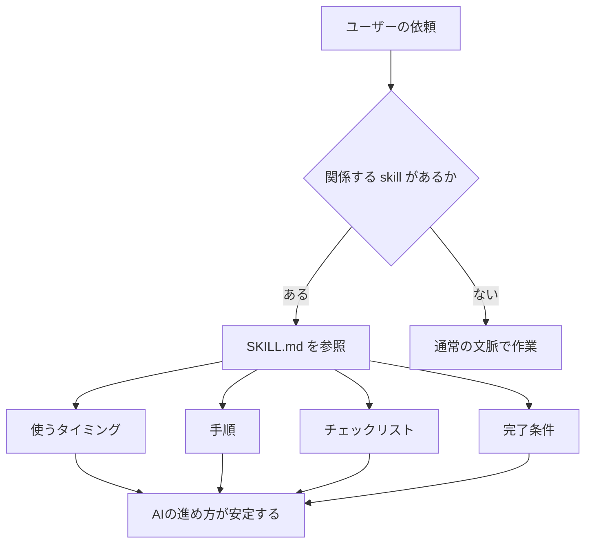
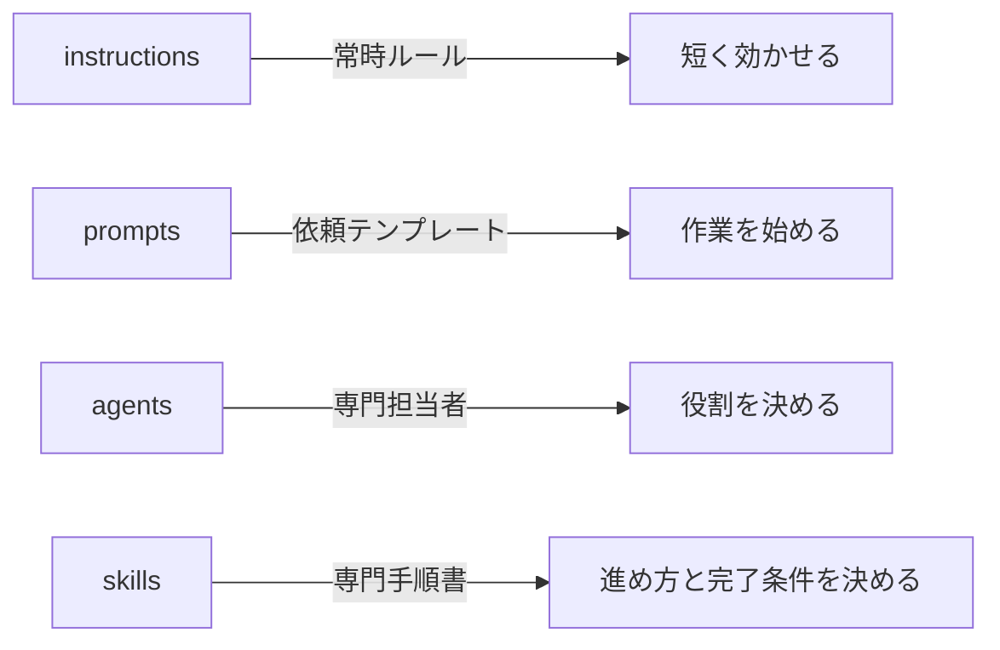

# skills ディレクトリ取扱説明書

`skills` は、AIに専門的な作業手順を渡すためのディレクトリです。各 skill はフォルダとして置き、その中に `SKILL.md` を置きます。

skill は「この場面では、こういう観点で、こういう順番で進めて、こういう完了条件で判断する」という作業マニュアルです。単なる説明文ではなく、AIの作業の質を揃えるための手順書です。

## skill とは何か

skill は、必要な時に参照する専門マニュアルです。



`instructions` は常時ルール、`prompts` は依頼テンプレート、`agents` は専門担当者です。`skills` は、専門作業の中身を詳しく書く場所です。

各 skill には必要に応じて `## Related assets` を置きます。これは prompts / agents / instructions から見た時に「この作業手順はどの入口や専門担当とつながるか」を逆引きするための短い索引です。

## 基本構造

```text
skills/
  example-skill/
    SKILL.md
```

`SKILL.md` の基本形は次のようになります。

```markdown
---
name: example-skill
description: どんな場面で使う skill かを短く説明する。
---

# Example Skill

この skill は、〇〇を進める時の手順です。

## Related assets

- 主な入口 prompts: `example-prompt`
- 主な agents: `example-agent`
- 関連 instructions: `example-instruction`

## 使うタイミング

- こういう作業をする時
- こういう問題を確認する時

## 手順

1. 最初に確認すること
2. 次に実行すること
3. 最後に検証すること

## Checklist

- [ ] 確認すること
- [ ] 見落としやすいこと

## Report

- 実行したこと:
- 検証したこと:
- 未検証:
```

## メタデータの意味

| 項目 | 何を書くか | 書く理由 | AIへの効き方 |
| --- | --- | --- | --- |
| `name` | skill の短い名前 | skill を識別するため | AIや利用者がどの skill か分かる |
| `description` | どんな場面で使うかを1文で書く | 必要な時に選ばれやすくするため | 依頼内容と skill の対応を判断しやすくなる |
| `allowed-tools` | 必要な場合だけ、使ってよい道具を制限する | skill 実行時の行動範囲を限定したい時に使う | 未指定なら通常の実行環境に任せる。必要がない限り固定しない |

このリポジトリの skill では、基本的に `name` と `description` を使います。`description` は特に重要です。ここが曖昧だと、どの作業で使うべき skill なのか分かりにくくなります。

## フォルダ名と `name`

フォルダ名と `name` は、できるだけ揃えます。

```text
skills/tdd-workflow/SKILL.md
```

```yaml
name: tdd-workflow
```

こうしておくと、人間がファイルを探す時も、AIが skill 名を扱う時も迷いにくくなります。

## `description` の書き方

`description` には、「何をする時に使うか」を具体的に書きます。

よい例:

```yaml
description: 新機能、bug fix、refactorで、失敗するテストから始めて最小実装、refactor、coverage確認まで進めるときに使う。
```

この文には、対象作業、進め方、確認内容が入っています。利用者もAIも「TDDで進める時の skill だ」と判断できます。

悪い例:

```yaml
description: テストについて説明する。
```

これだと、いつ使うのか、何をしてくれるのか、どこまで扱うのかが分かりません。

## 本文に書くこと

`SKILL.md` の本文には、AIがその作業を実行する時に必要な手順や判断基準を書きます。

| 見出し | 何を書くか | なぜ必要か |
| --- | --- | --- |
| `# ...` | skill のタイトル | 人間が何の手順書か分かるようにする |
| 冒頭文 | skill の目的 | AIに、この手順で何を達成するか伝える |
| `## Related assets` | 関連する prompts、agents、instructions | 入口や担当者から skill を逆引きしやすくする |
| `## 使うタイミング` | skill を使う場面 | 呼ぶべき時と呼ばない時を分ける |
| `## 手順`、`## Loop`、`## Phases` | 作業の順番 | AIが確認や検証を飛ばさないようにする |
| `## Checklist`、`## Review checklist` | 見落とし防止の確認項目 | レビューや設計の観点を揃える |
| `## Commands` | 実行する可能性があるコマンド | 検証方法を具体化する |
| `## Report`、`## 報告形式` | 報告テンプレート | 検証済み、未検証、残るリスクを分ける |
| `## 完了条件` | 作業を完了としてよい条件 | 実装しただけで終わらせないため |

すべての skill が同じ見出しを持つ必要はありません。大事なのは、その作業に必要な判断材料が入っていることです。実ファイルでは、作業領域に合わせて `原則`、`Review checklist`、`Phases`、`Loop`、`Report` など、見出し名を変えてかまいません。

## なぜ `使うタイミング` を書くのか

skill は、常に読むものではありません。必要な場面でだけ使います。そのため、どんな時に使う skill なのかを明確にします。

```markdown
## 使うタイミング

- 新しい endpoint を設計する
- 既存 API の contract を変更する
- error handling を見直す
```

これがあると、利用者は「今この skill を見るべきか」を判断できます。AIも、依頼内容と skill の対応を取りやすくなります。

## なぜチェックリストを書くのか

AIは、自然な文章だけだと重要な観点を落とすことがあります。チェックリストにすると、確認すべき項目が明示されます。

```markdown
## Review checklist

- [ ] validation が boundary にある
- [ ] log に token、password、PII が出ない
- [ ] test が behavior を見ている
```

このように書くと、AIはレビュー時に「読むべき観点」を持ちやすくなります。人間もレビュー結果を確認しやすくなります。

## なぜ完了条件を書くのか

skill は、作業の進め方だけでなく、終わり方も決めます。

悪い終わり方:

```text
コードを変更したので完了。
```

よい終わり方:

```text
関連テストを実行した。
失敗ケースを確認した。
未検証事項を報告した。
```

`完了条件` を書くと、AIが「作っただけ」で終わらず、検証や未確認事項の報告まで進めやすくなります。

## skill と他ディレクトリの違い



迷った時は、次のように分けます。

- 常に守ってほしい短いルールなら `instructions`
- 繰り返し使う依頼文なら `prompts`
- AIの役割や人格を定義するなら `agents`
- 専門的な手順、チェックリスト、完了条件を書くなら `skills`

## 作る時の手順

1. skill にしたい作業が、何度も使う専門手順か確認する。
2. `skills/<skill-name>/SKILL.md` を作る。
3. `name` はフォルダ名と揃える。
4. `description` に、使う場面を具体的に書く。
5. 冒頭文で、その skill の目的を書く。
6. `使うタイミング` で呼ぶ場面を明確にする。
7. `手順` や `Phases` で進め方を書く。
8. 必要に応じて、`Checklist` で見落としやすい観点を書く。
9. 必要に応じて、`Commands` や `Report` で検証と報告の形を書く。
10. 完了判断が重要な作業では、`完了条件` に何を満たしたら終わりかを書く。

## 書き方の注意

- skill は説明記事ではなく作業手順書です。読んだAIが行動を変えられる形で書きます。
- `description` は短くても具体的にします。
- コマンドを書く場合は、実際のプロジェクトで使う可能性があるものにします。
- チェックリストは、抽象語だけでなく確認できる項目にします。
- 完了条件には、検証済み、未検証、残る不確実性を分ける観点を入れます。
- 何でも入れすぎると使いづらくなるため、1つの skill は1つの作業領域に絞ります。
