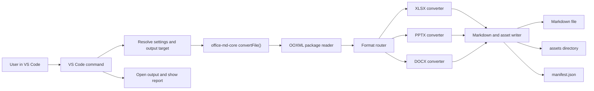

# Design Document

## Overview

The product is a VS Code extension named here as `Office Markdown` until a final name is chosen. It converts Office OOXML files into Markdown and assets:

```text
input.xlsx
input.md
input.assets/
  manifest.json
  sheet-001-image-001.png
  sheet-001-object-001.bin
```

The implementation should be split into a reusable conversion core and a thin VS Code extension layer. This makes tests faster, keeps parsing code independent from VS Code APIs, and leaves room for a future CLI without changing the conversion engine.

## Architecture



## Proposed Repository Layout

The implementation does not need to be committed exactly in this shape, but the next session should start from this layout unless there is a strong reason not to.

```text
packages/
  core/
    src/
      index.ts
      convert-file.ts
      options.ts
      manifest.ts
      ooxml/
        package-reader.ts
        relationships.ts
        content-types.ts
        xml.ts
        path-safety.ts
      markdown/
        markdown-writer.ts
        table-writer.ts
        text-normalizer.ts
      assets/
        asset-writer.ts
        filename-policy.ts
      converters/
        xlsx/
          xlsx-converter.ts
          shared-strings.ts
          worksheet-reader.ts
          drawing-reader.ts
          embedded-object-reader.ts
        pptx/
          pptx-converter.ts
          slide-reader.ts
          notes-reader.ts
          pptx-drawing-reader.ts
        docx/
          docx-converter.ts
          document-reader.ts
          numbering-reader.ts
          docx-media-reader.ts
      diagnostics/
        warning.ts
        conversion-error.ts
    test/
      fixtures/
      snapshots/
  vscode-extension/
    src/
      extension.ts
      commands/
        convert-current-file.ts
        convert-resource.ts
      ui/
        progress.ts
        result-notification.ts
      settings.ts
    package.json
```

## Extension Layer

### Commands

| Command ID | Surface | Behavior |
| --- | --- | --- |
| `officeMarkdown.convertResource` | Explorer context menu | Convert selected Office file. |
| `officeMarkdown.convertCurrentFile` | Command palette | Convert active editor file if supported. |
| `officeMarkdown.convertFolder` | Explorer context menu for folders | Post-MVP batch conversion. |
| `officeMarkdown.openLastManifest` | Command palette | Open last generated manifest for the workspace. |

### Context Menu Rules

Show file conversion command when the resource extension matches:

- `.xlsx`
- `.xlsm`
- `.pptx`
- `.docx`

Do not show for legacy formats in MVP. If the user invokes the command manually on an unsupported extension, show a clear error:

```text
This file type is not supported yet. Supported: .xlsx, .xlsm, .pptx, .docx.
```

### Settings

| Setting | Type | Default | Purpose |
| --- | --- | --- | --- |
| `officeMarkdown.outputLocation` | enum | `nextToSource` | `nextToSource`, `convertedFolder`, or `askEachTime`. |
| `officeMarkdown.overwritePolicy` | enum | `confirm` | `confirm`, `overwrite`, or `createUnique`. |
| `officeMarkdown.includeExcelHiddenSheets` | boolean | `false` | Include hidden sheets in Markdown. |
| `officeMarkdown.excelFormulaMode` | enum | `valuesWithManifest` | `valuesOnly`, `valuesWithManifest`, `inlineFormulaTable`. |
| `officeMarkdown.includePowerPointNotes` | boolean | `true` | Include speaker notes. |
| `officeMarkdown.includeConversionReport` | boolean | `true` | Append a human-readable report to Markdown. |
| `officeMarkdown.maxTableRows` | number | `1000` | Prevent huge Markdown tables. |
| `officeMarkdown.maxExtractedAssetBytes` | number | `50000000` | Per-asset extraction limit. |
| `officeMarkdown.maxPackageUncompressedBytes` | number | `300000000` | Zip safety limit. |

### User Flow

1. User right-clicks an Office file.
2. User selects `Convert Office File to Markdown`.
3. Extension resolves settings and output paths.
4. Extension shows progress.
5. Core converter generates Markdown, assets, and manifest.
6. Extension opens Markdown and shows one of:
   - Success with no warnings.
   - Success with warnings and a button to open manifest.
   - Failure with a clear error and optional partial output location.

## Core API

### Public API

```ts
export type SupportedFormat = "xlsx" | "xlsm" | "pptx" | "docx";

export interface ConvertFileOptions {
  inputPath: string;
  outputMarkdownPath?: string;
  outputAssetDir?: string;
  overwritePolicy: "confirm" | "overwrite" | "createUnique";
  includeConversionReport: boolean;
  excel: {
    includeHiddenSheets: boolean;
    formulaMode: "valuesOnly" | "valuesWithManifest" | "inlineFormulaTable";
    maxTableRows: number;
  };
  pptx: {
    includeSpeakerNotes: boolean;
  };
  safety: {
    maxPackageUncompressedBytes: number;
    maxExtractedAssetBytes: number;
    maxEntryCount: number;
  };
}

export interface ConversionResult {
  inputPath: string;
  markdownPath: string;
  assetDir: string;
  manifestPath: string;
  format: SupportedFormat;
  status: "success" | "partial" | "failed";
  warnings: ConversionWarning[];
  errors: ConversionErrorInfo[];
}

export async function convertFile(options: ConvertFileOptions): Promise<ConversionResult>;
```

The VS Code layer should not know OOXML details. It should call `convertFile()`, display progress, and open generated files.

## OOXML Package Reader

### Responsibilities

- Open the Office file as a ZIP package.
- Validate entry names before reading.
- Parse `[Content_Types].xml`.
- Parse relationship files ending in `.rels`.
- Resolve relationship targets safely.
- Expose XML parts and binary parts through a small API.

### Package Reader Interface

```ts
interface OoxmlPackage {
  listEntries(): PackageEntry[];
  readXml(partName: string): Promise<XmlNode>;
  readText(partName: string): Promise<string>;
  readBinary(partName: string): Promise<Uint8Array>;
  getRelationships(partName: string): Promise<Relationship[]>;
  getContentType(partName: string): string | undefined;
}

interface Relationship {
  id: string;
  type: string;
  target: string;
  targetMode?: "External" | "Internal";
  resolvedTarget?: string;
}
```

### Safety Rules

- Reject ZIP entries with absolute paths.
- Reject entries containing `..` after normalization.
- Do not write output using source-provided filenames directly.
- Do not follow external relationships.
- Do not execute macros.
- Enforce maximum entry count, total uncompressed bytes, and per-asset size.
- Read XML with entity expansion disabled or with a parser that does not resolve external entities.

## Markdown Output Model

The converters should produce a neutral intermediate model before rendering Markdown.

```ts
type MarkdownBlock =
  | { kind: "heading"; depth: number; text: string }
  | { kind: "paragraph"; text: string }
  | { kind: "list"; ordered: boolean; items: string[] }
  | { kind: "table"; rows: string[][]; caption?: string; truncated?: boolean }
  | { kind: "image"; alt: string; relativePath: string; sourceRef: SourceRef }
  | { kind: "assetLink"; label: string; relativePath: string; sourceRef: SourceRef }
  | { kind: "quote"; text: string; sourceRef?: SourceRef }
  | { kind: "code"; language: string; text: string }
  | { kind: "warning"; code: string; message: string; sourceRef?: SourceRef };
```

This intermediate layer allows testing conversion logic without depending on exact string formatting until the final writer snapshot tests.

## Output Layout

Default layout:

```text
<source-dir>/
  Quarterly Report.xlsx
  Quarterly Report.md
  Quarterly Report.assets/
    manifest.json
    sheet-001-image-001.png
    sheet-001-object-001.bin
```

For unsafe or long source filenames, sanitize only generated output names. Do not rename source files.

### Filename Policy

- Use lower-risk ASCII slug pieces where practical.
- Preserve known extensions from media parts.
- Use stable prefixes:
  - `sheet-001-image-001.png`
  - `sheet-001-object-001.bin`
  - `slide-002-image-001.jpeg`
  - `doc-image-001.png`
- Avoid user-provided path components in output filenames.
- Resolve collisions by appending `-002`, `-003`, etc.

## Manifest Model

`manifest.json` should be designed as the durable audit artifact.

```json
{
  "schemaVersion": 1,
  "tool": {
    "name": "office-markdown",
    "version": "0.1.0"
  },
  "source": {
    "fileName": "sample.xlsx",
    "format": "xlsx",
    "sizeBytes": 123456
  },
  "output": {
    "markdownFile": "sample.md",
    "assetDir": "sample.assets"
  },
  "items": [
    {
      "id": "asset-001",
      "kind": "image",
      "source": {
        "container": "sheet",
        "name": "Sheet1",
        "index": 1,
        "part": "xl/media/image1.png",
        "anchor": "B4"
      },
      "output": {
        "path": "sample.assets/sheet-001-image-001.png",
        "markdownRef": ""
      },
      "contentType": "image/png",
      "status": "extracted"
    }
  ],
  "warnings": [
    {
      "code": "unsupported-smartart",
      "message": "SmartArt was detected but cannot be reconstructed in MVP.",
      "source": {
        "container": "slide",
        "index": 3
      }
    }
  ],
  "errors": []
}
```

## Excel Conversion Design

### Source Parts

Important parts:

- `xl/workbook.xml`: sheet list and workbook metadata.
- `xl/_rels/workbook.xml.rels`: sheet part relationships.
- `xl/sharedStrings.xml`: shared string table.
- `xl/styles.xml`: optional number format support.
- `xl/worksheets/sheet*.xml`: cells, rows, merges, hyperlinks, comments/drawing references.
- `xl/worksheets/_rels/sheet*.xml.rels`: drawings, hyperlinks, comments, embedded object relationships.
- `xl/drawings/drawing*.xml`: anchors, pictures, text-bearing shapes, chart references.
- `xl/drawings/_rels/drawing*.xml.rels`: image/chart target relationships.
- `xl/media/*`: image binaries.
- `xl/embeddings/*`: embedded objects or OLE payloads.
- `xl/charts/chart*.xml`: chart metadata and series references.

### Markdown Structure

```md
# Workbook: sample.xlsx

## Sheet 1: Summary

| A | B | C |
| --- | --- | --- |
| ... | ... | ... |


### Text Box: Summary object 1

> Extracted text from shape.

[Embedded object: Summary object 1](sample.assets/sheet-001-object-001.bin)
```

### Cell Extraction

The MVP should:

- Preserve sheet order from workbook metadata.
- Use sheet names as headings.
- Extract non-empty used ranges.
- Resolve shared strings.
- Represent booleans, numbers, strings, dates, and errors.
- Record formula cells in manifest.
- Optionally emit a formula table.
- Represent merged cells by putting the visible value in the top-left cell and recording merge ranges in manifest.

The MVP does not need to calculate formulas. It should use cached values when present and record the formula text.

### Image Extraction

The converter should:

1. Find worksheet drawing relationships.
2. Read drawing XML.
3. Find picture nodes and their relationship IDs.
4. Resolve relationship targets to `xl/media/*`.
5. Save binary assets using the filename policy.
6. Insert image Markdown near the related sheet section.
7. Record the anchor if available.

If exact cell insertion order is hard, MVP can group images after the table under the sheet section, sorted by anchor row/column.

### Text-Bearing Drawings

For simple shapes and text boxes:

- Extract text runs such as DrawingML text nodes.
- Emit them as object subsections or quote blocks.
- Record source anchor and drawing part in manifest.

If shape geometry or styling cannot be represented, emit text plus a warning only when meaningful content could be missing.

### Embedded Objects

For relationships to embedded packages/OLE objects:

- Save the target binary part into assets.
- Link it from Markdown.
- Record original relationship type, content type, source sheet, and anchor when available.
- If the embedded object is itself an OOXML package and its extension/content type can be identified, a post-MVP task may recursively convert it.

MVP should not try to execute or open embedded content.

### Charts

MVP behavior:

- Detect chart relationships.
- Emit chart title if easy to extract.
- Emit series names and referenced ranges if easy to extract.
- Record unsupported chart visual rendering as a warning.

Post-MVP:

- Convert chart data into Markdown tables.
- Render chart visuals to images using a pure JS renderer if practical.

## PowerPoint Conversion Design

### Source Parts

Important parts:

- `ppt/presentation.xml`: slide order.
- `ppt/_rels/presentation.xml.rels`: slide relationships.
- `ppt/slides/slide*.xml`: slide content.
- `ppt/slides/_rels/slide*.xml.rels`: slide images, charts, embedded objects, notes references.
- `ppt/notesSlides/notesSlide*.xml`: speaker notes.
- `ppt/media/*`: image binaries.
- `ppt/embeddings/*`: embedded objects.
- `ppt/charts/chart*.xml`: chart metadata.

### Markdown Structure

```md
# Presentation: sample.pptx

## Slide 1

# Slide title

- Body bullet
- Body bullet


### Speaker Notes

Speaker notes text.
```

### Text Extraction

The MVP should:

- Preserve slide order.
- Extract text from text frames.
- Preserve bullet-like text as Markdown lists where list metadata is simple.
- Extract table cells as Markdown tables.
- Preserve hyperlinks when available.

### Images and Objects

The converter should:

- Extract slide images from relationships.
- Link images under the relevant slide.
- Preserve embedded objects as assets and links.
- Record unsupported complex objects in manifest.

### Speaker Notes

Speaker notes are included by default. If a note slide cannot be resolved, record a warning and continue.

## Word Conversion Design

### Source Parts

Important parts:

- `word/document.xml`: main document body.
- `word/_rels/document.xml.rels`: image, hyperlink, embedded object relationships.
- `word/media/*`: images.
- `word/embeddings/*`: embedded objects.
- `word/numbering.xml`: ordered/unordered list mapping.
- `word/styles.xml`: heading and paragraph style hints.
- `word/footnotes.xml`: footnotes.
- `word/endnotes.xml`: endnotes.

### Markdown Structure

```md
# Document: sample.docx

# Heading 1

Paragraph text with [link](https://example.com).

- List item
- List item

| Column A | Column B |
| --- | --- |
| Value A | Value B |


```

### Text Extraction

The MVP should:

- Convert heading styles to Markdown headings.
- Convert paragraphs to paragraphs.
- Convert simple ordered and unordered lists.
- Convert tables to Markdown tables.
- Preserve hyperlinks.
- Extract images and embedded objects through relationships.

Footnotes and endnotes should be attempted if straightforward. If not implemented in first pass, record as a warning and task.

## Asset And Object Policy

The guiding rule is:

```text
If it can be text, output text.
If it could contain information that text extraction misses, preserve it as an asset.
If it cannot be represented, report it.
```

Examples:

| Source item | Markdown behavior | Asset behavior | Manifest behavior |
| --- | --- | --- | --- |
| Image | `` | Save image | extracted |
| Text box | Quote or object subsection | No asset unless backing binary exists | extracted text |
| Embedded DOCX | Link to asset; post-MVP may recursively convert | Save object | extracted or preserved |
| OLE `.bin` | Link to asset | Save `.bin` | preserved with warning if type unknown |
| Chart | Title/series/ranges when possible | No image in MVP | partial with warning |
| SmartArt | Extract text if possible | Preserve related assets if any | partial/unsupported |

## Error Handling

### Severity Levels

| Severity | Meaning | User-facing behavior |
| --- | --- | --- |
| `info` | Non-critical note, such as hidden sheet skipped. | Manifest only or report section. |
| `warning` | Partial extraction, unsupported object, truncated table. | Success with warnings. |
| `error` | A component failed but partial output may exist. | Partial result with clear message. |
| `fatal` | Conversion cannot continue. | No success result; show VS Code error. |

### Common Error Cases

- Unsupported extension: fail before reading.
- Invalid ZIP: fatal.
- Missing required OOXML part: fatal for that format.
- Missing media relationship target: warning.
- Oversized asset: warning and skip asset.
- Oversized package: fatal unless safe partial processing is possible.
- Password-protected or encrypted file: fatal with clear unsupported message.

## Testing Strategy

Use three layers:

1. Unit tests for package reading, relationship resolution, path safety, Markdown rendering, and manifest generation.
2. Fixture integration tests for each file type.
3. VS Code extension tests for command registration, context menu command behavior, settings resolution, progress/result handling, and output file writing.

Fixture strategy:

- Use minimal OOXML fixtures committed to tests where possible.
- Include one realistic fixture per supported format.
- Avoid depending on Office, LibreOffice, Pandoc, or external binaries for tests.
- Use snapshot tests for generated Markdown and manifest JSON.

## MVP Scope

The MVP should prioritize:

- Correct local conversion path.
- Safe extraction.
- Asset preservation.
- Transparent warnings.
- VS Code user flow.

The MVP should not spend effort on visual perfectness or legacy Office support.

## Risks

| Risk | Impact | Mitigation |
| --- | --- | --- |
| OOXML complexity is larger than expected. | Conversion misses objects or ordering. | Start with fixture-driven TDD and manifest warnings. |
| Excel drawing anchors are hard to map precisely. | Images may appear after a sheet instead of exact row location. | MVP groups by sheet and sorts by anchor; exact placement is post-MVP. |
| OLE object type detection is inconsistent. | Object links may be `.bin` without useful labels. | Preserve binary asset and record relationship/content type. |
| Large spreadsheets create unreadable Markdown. | Markdown becomes huge or slow. | Add `maxTableRows`, truncation warnings, and manifest metadata. |
| Extension package grows too large. | Poor install/update experience. | Avoid external binaries and heavy OCR/chart renderers in MVP. |
| Malicious Office packages. | Security issue. | Enforce ZIP/path/resource limits and no external fetch/execution. |

## Design Decisions

### DD-001: Build a native TypeScript core instead of shelling out to tools

Reason: The user wants a VS Code extension that works without separate installs. Shelling out to MarkItDown, Pandoc, LibreOffice, or Python would make setup fragile.

### DD-002: Treat MarkItDown as inspiration, not a runtime dependency

Reason: MarkItDown is useful for understanding expected Markdown-oriented output, but the desired Excel asset preservation requires stronger OOXML asset handling.

### DD-003: Preserve original assets even when text is extracted

Reason: Object text extraction can miss styling, embedded binary data, charts, diagrams, and scanned information. Preserving assets prevents silent information loss.

### DD-004: Use manifest warnings as part of success

Reason: Office conversion is inherently lossy for complex objects. Users need to know what happened without treating every unsupported visual feature as a total failure.

### DD-005: Do not support legacy binary Office formats in MVP

Reason: `.xls`, `.ppt`, and `.doc` require different parsing strategies or external tools. Supporting them would conflict with the no-extra-install MVP.
